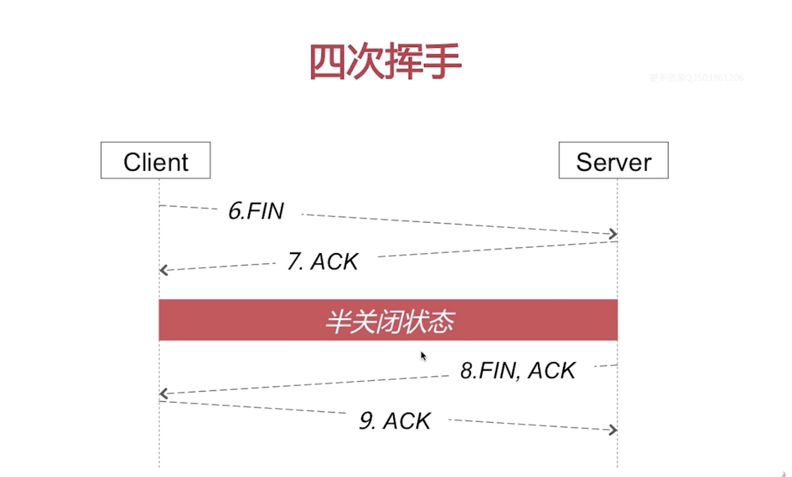

# 网络

> [http协议](##http)
>
> [https与网络安全](##https-&-security)
>
> [TCP/UDP](##tcp/udp)
>
> [dns解析](##dns)
>
> [session and cookie](##session-cookie)
>
> [JSON Web Tokens](##tokens)

## http

> 你是怎样理解http的

* [请求报文](###make-a-request)
* [响应报文](###make-a-response)
* [连接建立流程](###make-a-connection)
* [http的特点](###http-pros)

### Make a Request

1. 请求行：

* 方法： get, post

* url: the address where you want to go

* 协议版本: http 1.1

  回车换行

2. Header (key-value): ...:...

3. body
   1. if it's a GET, then we don't have body
   2. if it's a POST, then we will insert a body

### Make a Response

1. first line
   * version
   * state id
   * short sentence

2. Key-value
3. Body

==What are methods for http request?==

GET, POST, HEAD, PUT, DELETE, OPTIONS

==What diff between GET and POST?==

* GET: put parameter by ? on url
  * used to get response
  * and it's safe, 幂等性,cached

* POST : will put parameter inside the body
  * used to handle the resource
  * Unsafe, 非幂等性，not cached

> SAFE: stateless, doesn't make any changes on server
>
> ​	ex: GET, HEAD, OPTIONS
>
> 幂等性：同一个请求方法执行多次与执行一次的效果完全相同。
>
> ​	ex. PUT， DELETE， GET

==what are the state code and their meaning?==

* 1xx, 2xx, 3xx, 4xx, 5xx

* 2xx: succeed

* 3xx: redirected

* 4xx: clients request has something wron

* 5xx: server doesn't work now

### Make a connection


* Client and server's three times connection

  三次握手：

  * client wants a **sync** to the server
  * Server received and response comfirmed **sync** **ack** to client
  * client confirms ( **ack**) the http

  

  * client send a http request to server
  * Server send the http response to client

  

  四次挥手：

  * Client send **fin** (finish) to server
  * server send a **ack** (confirmed) back to client
  * since server is probably still sending data to client, so server will send **fin,ack** to let client know when it's completely over.
  * Client will confirm it by **ack**

> ==Why Three times for make a connection?== [sol](##why-3?)
>
> ==Why two directions for breaking the connection?== [sol](##why-2-times?)

### HTTP Pros

* connectionless
  * **HTTP is connectionless:** It is a connectionless approach in which HTTP client i.e., a browser initiates the HTTP request；  <u>After the request is sent， the client disconnects from server and waits for the response</u>.
  * Sol: http persistent connection -  to increase the effective of working.
  * 
  * ==How to determine a reques has been finished?== 
    * Content-lenth: 1024
    * Chunked: 最后一个是空的chunked
  * ==Charles抓包原理是怎样的？==
    *  <code>中间人攻击</code> Man in the middle attack
      * 一般是直连client 和server
      * 而中间人就是把中间人当成代理， client 与 server之间的交互都是通过中间人
      * [REF](https://www.jianshu.com/p/870451cb4eb0)
      * 
      * [Postman](https://blog.postman.com/client-proxy-settings-in-postman/)
      * *Because Google Analytics uses a secure connection by default, Charles must be instructed to intercept Google Analytics traffic.* [reference](https://www.bounteous.com/insights/2016/11/17/using-charles-proxy-inspect-and-debug-google-analytics/?lang=en-ca) 
      * sol: *Installing the Charles Certificate: To read secure traffic in both directions, Charles needs to un-encrypt secure traffic from the server, and replace the server’s encryption with its own. For this to work, we need to install a certificate that tells your browser to trust Charles. Charles can provide such a certificate, but it takes a lot of clicking to make it work.*
* stateless
  * **HTTP is stateless:** The client and server are aware of each other during a current request only. Afterwards, both of them forget each other. Due to the stateless nature of protocol, neither the client nor the server can retain the information about different request across the web pages.
  * Server doesn't know if it's from the same client
    * Cookie/session

## Https & Security

==What is difference between HTTPS and HTTP?==

HTTPS = HTTP + SSL/TLS


* IP: 网络层
* TCP：传输层
* http：应用层
* ssl/tls：应用层之下，传输层之上 （新插入的）
* sol： https是安全的http；它的安全性是由ssl/tls插在应用层之下，传输层之上保证的

==What is the connection process for https?==


* 3. 验证 server public key - check if it's legal
  4. make a <code>meeting private key</code>
  5. send the <code>server's public key(预主密钥)</code> to server
* 会话密钥 = random s + random c + 预主密钥(provied by client) ； 代表对称加密的结果

==HTTPS都使用了那些加密手段？为什么？==

* 连接建立过程使用**非对称加密**，耗时； 因此数据传输应用对称加密
* 后续通信过程使用**对称加密**

==What is 非对称加密？== 加密与解密所使用的钥匙是不一样的 - **公钥 vs 私钥**


==What is 对称加密？== 加密与解密都用同一个钥匙


* 缺点：密钥可能需要传输传递，但是传递过程会容易发生中间人攻击。因此会容易被破译。

## TCP/UDP

传输层协议

* [tcp](###tcp)： 传输控制协议
* [udp](###udp)： 用户数据报协议

### UDP

#### 特点

* connectionless： no need to construc/release process
* 尽最大努力传输： 不保证可靠传输
* 面向报文 - 完整传输
  * 

#### 功能

#### 复用，分用


#### 差错检测


### TCP

特点

* [面向连接](####面向连接)
* [可靠传输](####可靠传输)
* [面向字节流](####面向字节流)
* [流量控制](####流量控制)
* [堵塞控制](####堵塞控制)


#### 面向连接：

* 三次握手： 数据传输前，要建立连接

  #### ==why 3？==

  * 
  * 如果只有两次的话： 假设第一次client的syn发生了超时，client会启动从新传送策略。所以在server发送2.syn **Syncheonize sequence number**,ack **Acknowlegement**（表示连接已经建立完毕）以后有可能再收到一个client发送的1.syn，于是再发送了一个2.syn，ack。而client只想建立一个http连接。
  * 三次的话，client就会针对某一个syn，ack发送ack确认。另外一个超时的，client就不会再发送ack表示它没有想真正建立这个连接。
  * 总结：可以规避连接之间发生的异常。

* 四次挥手：数据传输后，释放连接

  #### ==why 2 times?==

  

  半关闭状态以后client不可以再给server发送东西。而server可以，server需要继续玩成它的内容

  客户端/server **全分工**： 因为两方端点都可以进行沟通。所以需要双方面的连接释放。

  ​	

#### 可靠传输

* 无差错
* 不丢失
* 不重复
* 按序到达

==Tcp 怎样保证可靠传输？==

​	停止等待协议

		* 无差错： 有一对一的回复
		* 超时重传： 超过一定时间没有回复，再传输一次
  * 确认丢失：指在server回复client的信息被中断，client再超时重传的时候，server可以选择放弃之前的，确认重传的。
    		* 
* 确认迟到
  * 

#### 面向字流节

* 
* 发送方和接收方都有tcp的缓冲
* 每次发送多少字节，由tcp连接控制
* 不管发送方法多少给tcp，tcp本身都可以根据实际情况来划分我每次发送给接收方有多少字节。

#### 流量控制

* ==什么是滑动窗口协议以及你怎么理解？== - 按序到达也是滑动窗口的体现
  * 

#### 堵塞控制

* 慢开始，拥塞避免
* 快恢复，快重传

## DNS

==了解dns吗？==

域名到ip地址的映射，dns解析请求采用**udp**数据报，且**明文**

client first find the ip of url on DNS server, then DNS server will return IP to the client. Then client will send request to its IP server

==DNS query methods?==

* recursively

  * "Let me ask for you"
    * 

* Iteratively

  * "let me give you a list of possible reference for you"

    * 

    根->顶级->权限

DNS问题

* DNS劫持
  * 
  * ==dns劫持与http的关系是怎样的？==
    * 没有关系
    * dns解析发生在http建立连接之前
    * dns解析请求使用udp数据报，端口号53
  * ==怎样解决dns劫持？==
    * httpdns：
      * 从使用dns协议向dns服务器的53端口进行请求 改成
      * 使用http协议向dns服务器的80端口进行请求
    * 长连接
* dns解析转发
  * 

## Session Cookie

[reference](https://juejin.im/post/5aa783b76fb9a028d663d70a)

> Session-Based Authentication: 根据http stateless的特点补偿， server端不知道client发送的请求是谁。

#### Cookie

> 用于记录用户状态，区分用户；**保存在客户端**

Cookie会根据响应报文里的一个叫做Set-Cookie的首部字段信息，通知客户端保存Cookie。当下客户端再向服务端发起请求时，客户端会自动在请求报文中加入Cookie值之后发送出去.

==怎样删除cookie？==

* 新cookie覆盖旧cookie
* 覆盖规则： name，path， domain等需要与原cookie一致
* 设置cookie的**expires=过去某一个时间点**，或者**maxage=0**

==怎样保证cookie的安全？==

* 对cookie进行加密处理
  * 脚本攻击其实也会或许cookie，进行破解
* 只在https上携带cookie
* 设置cookie为httponly，防止跨站脚本攻击


1. http request
2. generate cookie
3. http response will bring this cookie and return it to client
   1. server can add set-cookie to send cookie to client
4. client will save it
   1. client will add cookie info in the http header.

> 客户端发送的cookie在http请求报文的Cookie首部字段中
>
> 服务端设置http响应报文的Set-Cookie首部字段

#### Session

>  用于记录用户状态，区分用户；**保存在服务器端**

session需要cookie的机制


### set-Cookie的字段的属性


```json
Set-Cookie: logcookie=3qjj; expires=Wed, 13-Mar-2019 12:08:53 GMT; Max-Age=31536000; path=/;
 domain=fafa.com;secure; HttpOnly;
```


以上面的set-cookie的例子，说一下set-cookie的属性

1. `logcookie=3qjj` 赋予Cookie的名称和值，logcookie是名字 ，3qjj是值

2. expires 是设置cookie有效期。当省略expires属性时，Cookie仅在关闭浏览器之前有效。可以通过覆盖已过期的Cookie，设置这个Cookie的过期时间是过去的时间，实现对客户端Cookie 的实质性删除操作。

3. path 是限制指定Cookie 的发送范围的文件目录。不过另有办法可避开这项限制，看来对其作为安全机制的效果不能抱有期待。

4. domain 通过domain属性指定的域名可以做到与结尾匹配一致。比如，指定domain是fafa.com，除了fafa.com那么www.fafa.com等都可以发送Cookie。

5. secure 设置web页面只有在HTTPS安全连接时，才可以发送Cookie。HHTP则不可以进行回收。

6. HttpOnly 它使JavaScript 脚本无法获得Cookie，通过上述设置，通常从Web 页面内还可以对Cookie 进行读取操作。但使用JavaScript 的document.cookie 就无法读取附加HttpOnly 属性后的Cookie 的内容了

> 修改一个新的cookie时
>
> * 让新的cookie覆盖旧的cookie
> * 覆盖规则：name，path， domain等需要与原cookie一致


#### Session与Cookie的区别

* Cookie数据存放在客户的浏览器（客户端）上，session数据放在服务器上，但是服务端的session的实现对客户端的cookie有依赖关系的；

* Cookie不是很安全，别人可以分析存放在本地的COOKIE并进行COOKIE欺骗，考虑到安全应当使用session；

* Session会在一定时间内保存在服务器上。当访问增多，会比较占用你服务器的性能。考虑到减轻服务器性能方面，应当使用COOKIE；

* 单个cookie在客户端的限制是3K，就是说一个站点在客户端存放的COOKIE不能超过3K；

## Tokens

>  Token-Based Authentication

[reference](https://medium.com/better-programming/json-web-tokens-vs-session-cookies-for-authentication-55a5ddafb435)

In a token-based application, the server creates a signed token and sends the token back to the client. The JWT is stored **on the client’s side** (usually in local storage) and sent as a header for every subsequent request.

#### JWT

JSON Web Token (JWT) is an open standard (RFC 7519) for securely transmitting information between endpoints as JSON objects. It is mainly used to prove that the sent data was actually created by an authentic source.

JWT consists of three concatenated Base64url-encoded strings, separated by dots (.), which are:

1. [Header](####header)
2. [Payload](####payload)
3. [Signature](####signature)

A JWT typically looks like:

```
 xxxxx.yyyyy.zzzzz
```

#### Header

The first part typically consists of two parts; the type of the token, which is JWT, and the signing algorithm being used such as HMAC SHA256 or RSA. If you don’t define the algorithm, it uses HS256 by default.

For example:

```json
{
	"alg": "HS256",
	"typ": "JWT"
}
```

#### Payload

The second part consists of a set of claims that are basically verifiable security statements, such as the identity of the user and the permissions they are allowed.

There are three types of claims: registered, public, and private claims. Note that the claim names are short as JWT is meant to be compact for fast requests.

And wait! Be careful not to put sensitive data such as passwords in your payload as this can easily be decoded.

An example payload could be:

```json
{
"sub": "123456789",
"name": "Anamika Ahmed",
"admin": true
}
```

#### Signature

The last part is the signature which is the sum of the encoded header, the encoded payload, a secret, and lastly, the algorithm which is specified in the header.

For example, if you want to use the HS256 algorithm, the signature would be created in the following way:

```
HS256(
base64UrlEncode(header) + “.” +
base64UrlEncode(payload),
secret)
```

The signature is used to verify the message wasn’t changed along the way. It is the most important part of the JWT structure as header and payload can easily be decoded, but not the signature.

The signature is not publicly readable because it is encrypted with a secret key. Unless someone has the secret key, they cannot decrypt this information.

[https://jwt.io](https://jwt.io/introduction/)


## Token vs Session


* Token stores in client side while session use server memory
* Token JWT is much bier than session ID stored in Cookie and contains more user information.

| Session-Based Authentication                                 | Token-Based Authentication                                   |
| :----------------------------------------------------------- | :----------------------------------------------------------- |
| User enters their login credentials (username + password).   | User enters their login credentials (username + password).   |
| Server verifies the credentials are correct and creates a session which is then stored in a database. | Server verifies the credentials are correct and created an encrypted and signed token with a private key ( { username: “abcd”, exp: “2019/1/9/10:00” }, private key => token). |
| Client side stores the session ID returned from server       | Client side stores the token returned from server.           |
| On subsequent requests, the session ID is verified against the database and if valid the request processed. | On subsequent requests, the token is decoded with the same private key and if valid the request processed. |
| Once a user logs out of the app, the session is destroyed on server side. | Once a user logs out, the token is destroyed **client-side**, no interaction with the server is necessary. |


### Advantages of Token-Based Authentication

Stateless, Scalable and Decoupled

* Stateless: The back-end does not need to keep a record of tokens. 
* Self-contained, containing all the data required to check its validity. No DB look up is needed. 

Mobile Friendly

* Native mobile platforms and cookies do not mix well. With a session based approach, you simply store the session ID in a cookie. 

### Disadvantages of Token-Based Authentication

Usually the size of token is larger than a session id.