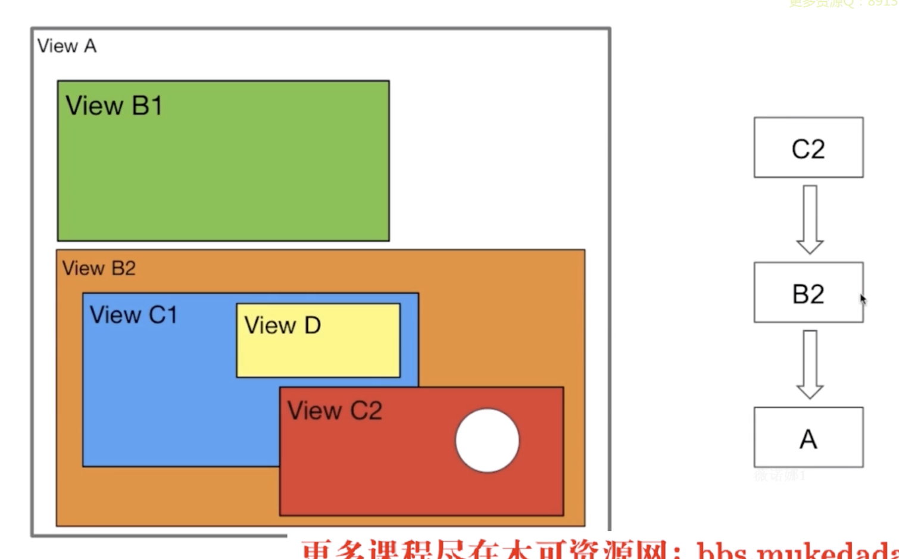

## UIView vs CALayer

> 常考题：UIView 和CALayer之间的关系是怎样的？
>
> 答： uiview负责事件传递及事件响应
>
> ​		calayer负责显示内容


* uiview 里面的layer就是calayer
* uiview里面真对backgroundcolor的操作其实是针对calayer里面的func一种操作。它是一种封装
* uiview显示的内容是一种bitmap，在backing store里。
* **uiview为其（calyer）提供内容，以及负责处理触摸等事件传递，参与*响应链***
* **calayer只是用来负责显示内容**

> 单一原则

## 事件传递

> 常考题：系统的UI事件传递机制是怎样的？
>
> 答：从hitTest 以及pointInside上回答

```objective-c
-(UIView *) hitTest:(CGPoint)point withEvent:(UIEvent *)event;
//return uiview which has reaction to the event

-(BOOL)pointInside(CGPoint)point withEvent:(UIEvent *)event;
//return yes if the point is in the range 
```


* 倒叙：从最后一个被加入的view最优先，再调用其hittest方法
* 递归：每一个subview都是同样的操作，调用其内部的hittest，其子也会再再调用
* 如果找到就把那个uiview返回，如果没有则返回uiwindow最为最终答案

## hitTest:withEvent 系统内部实现

* 优先判断其内部属性 hidden， userinteractionenabled，以及alpha，是否作为事件的优先响应者
* 再遍历同级兄弟节点
* 再由pointinside判断是否在合理范围
  * 如果不在合理范围，return nil
  * 如果在合理范围，则倒叙遍历每个subview -> hitTest

 


## 代码 - 圆形button，四边角不识别，只识别中心的圆形

main

```objective-c
#import "ViewController.h"
#import "CustomButton.h"

@interface ViewController ()
{
    CustomButton *cornerButton;
}
@end

@implementation ViewController

- (void)viewDidLoad {
    [super viewDidLoad];
    
    cornerButton = [[CustomButton alloc] initWithFrame:CGRectMake(100, 100, 120, 120)];
    cornerButton.backgroundColor = [UIColor blueColor];
    [cornerButton addTarget:self action:@selector(doAction:) forControlEvents:UIControlEventTouchUpInside];
    [self.view addSubview:cornerButton];
    // Do any additional setup after loading the view, typically from a nib.
    self.view.backgroundColor = [UIColor whiteColor];
}

- (void)doAction:(id)sender{
    NSLog(@"click");
}


- (void)didReceiveMemoryWarning {
    [super didReceiveMemoryWarning];
    // Dispose of any resources that can be recreated.
}


@end
```

Custombutton 的编写

```objective-c
//header
#import <UIKit/UIKit.h>

@interface CustomButton : UIButton

@end


//main

@implementation CustomButton

- (UIView *)hitTest:(CGPoint)point withEvent:(UIEvent *)event
{
    if (!self.userInteractionEnabled ||
        [self isHidden] ||
        self.alpha <= 0.01) {
        return nil;
    }
    
    if ([self pointInside:point withEvent:event]) {
        //遍历当前对象的子视图
        __block UIView *hit = nil;
      	//这里倒叙遍历
        [self.subviews enumerateObjectsWithOptions:NSEnumerationReverse 
         																usingBlock:^(__kindof UIView * _Nonnull obj,
                                                     NSUInteger idx, 
                                                     BOOL * _Nonnull stop) {
            // 坐标转换
            CGPoint vonvertPoint = [self convertPoint:point toView:obj];
            //调用子视图的hittest方法
            hit = [obj hitTest:vonvertPoint withEvent:event];
            // 如果找到了接受事件的对象，则停止遍历
            if (hit) {
                *stop = YES;
            }
        }];
        
        if (hit) {
            return hit;
        }
        else{
            return self;
        }
    }
    else{
        return nil;
    }
}

- (BOOL)pointInside:(CGPoint)point withEvent:(UIEvent *)event
{
    CGFloat x1 = point.x;
    CGFloat y1 = point.y;
    
    CGFloat x2 = self.frame.size.width / 2;
    CGFloat y2 = self.frame.size.height / 2;
    
    double dis = sqrt((x1 - x2) * (x1 - x2) + (y1 - y2) * (y1 - y2));
    // 67.923
    if (dis <= self.frame.size.width / 2) {
        return YES;
    }
    else{
        return NO;
    }
}

@end

```

## 事件响应流程


* 紫色的是UIApplication
* 粉色的是UIApplicationDelegate

## 视图事件响应方法 - responsder

```objc
-(void)touchesBegan:(NSSet *)touches withEvent:(UIEvent *)event;
-(void)touchesMoved:(NSSet *)touches withEvent:(UIEvent *)event;
-(void)touchesEnded:(NSSet *)touches withEvent:(UIEvent *)event;
```



* 点击白色圆形，从c2一路返回给它的父亲A
* 如果A无法响应，则再一路上传传到UIApplicationDelegate
* 如果UIApplicationDelegate无法响应，最终，**忽略掉这个事件**

