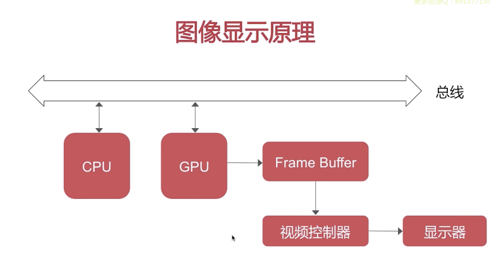
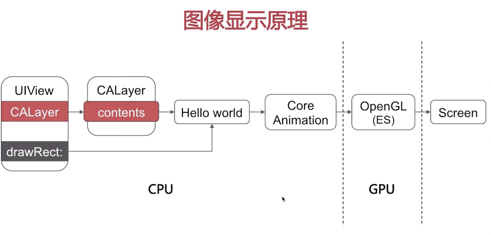
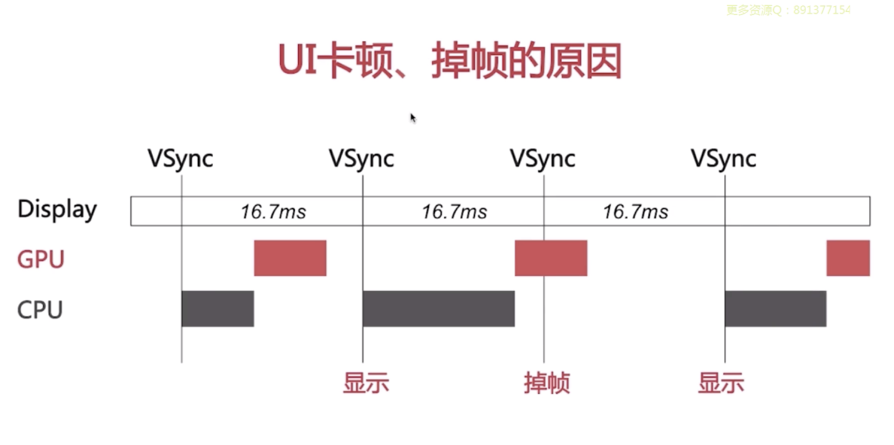
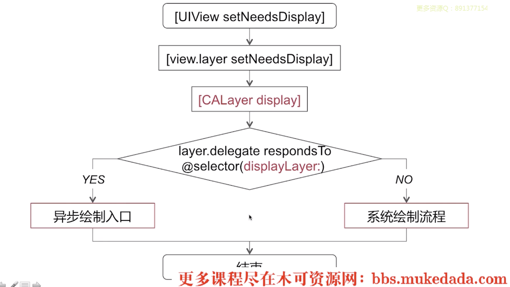
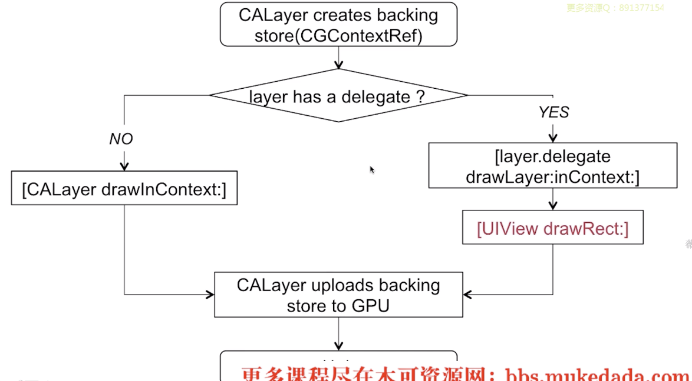
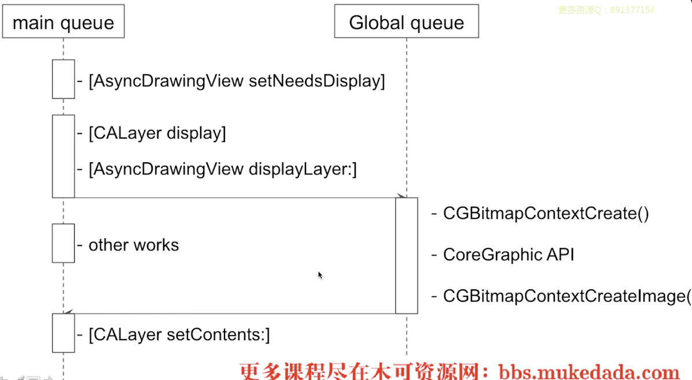

## 图像显示原理 - ui 卡顿，掉帧原因等

> 常考题：如何使UITableView滚动更流畅的方案或思路有哪些？此题要从cpu和gpu两个方面入手 [look](#滑动优化方案)



* cpu generate bitmap
* gpu render the bitmap
* 视频控制器根据时间从framebutter提取要显示的内容，再到显示器上显示。


> 常考题：UIView 和CALayer之间的关系是怎样的？
>
> 答：uiview -> event handling
>
> ​		calayer -> content display

uiview中显示的内容由calayer来负责。uiview只负责事件响应。content最终要显示的就是一个bitmap。 比如一个uilabel要显示hello world，则content就显示这个位图 。系统会在合适的时机回调一个drawrect方法。再此基础上可以自定义显示的内容。绘制好后的内容会由core animation框架提交给gpu中的OpenGL(ES)管线进行位图渲染和纹理合成，再显示在屏幕上面。

## cpu工作内容

* layout 
  * ui布局：the control of ui component's frame
  * 文本计算： uilabel size etc
* display
  * 绘制： drawrect
* prepare
  * 图片解码器： uiimageview图片不能直接显示在屏幕上，需要对图片进行解码。而解码的动作就发上在图片解码器里
* commit
  * 对绘图的提交 -> 这块开始由gpu工作

## gpu render pipeline

* 顶点着色

* 图元装配

* 光栅化

* 片段着色

* 片段处理

  >  所有步骤结束后，会把像素点放在framebuffer里

  

## ui卡顿掉帧原因

> 整个过程每秒走60frames
>
> 在规定的16.7ms之内，下一针vsync到来的之前gpu还未有完成cpu交代的工作 （gpu与cpu工作的合成，于是导致掉帧）



> sol：思考如何提高uitableview，uiscrollableview滑动流畅性


## 滑动优化方案

1. 减轻cpu时长
   * 对像创建，调整\*，销毁\*： 可以放在子线程上
   * 预排版：布局计算， 文本计算 可以放在子线程上
   * 预渲染：文本等异步绘制，图片编辑吗等\*

2. gpu上-异步绘制机制
   * render： **离屏渲染**-> 产生的圆角，阴影等。对于此情况，**尽量避免离屏渲染**
   * 视图混合：层层叠加的时候，需要合成每一个layer，考虑其像素点。需要做大量的计算。如果能减轻其复杂性，就可以省其压力。也可以用异步绘制机制，让其变成层级较少的计算。

> [更多细节](https://juejin.im/post/5b72aaf46fb9a009764bbb6a)

## UIView 绘制原理 - （中高级）



* Step1. uiview setNeesDisplay不是立刻开始试图绘制的操作 - 可通过流程图看出
* Step2. 会对当前view.layer打上**脏标记**
* Step3. 在当前快要结束的时候才会调用CALayer display，再进入主流程。 当前runloop将要结束的时候才会开始进入UI视图绘制流程当中。
* Step4. 看响不响应displayLayer这个func

### 系统绘制流程




### 异步绘制

```objc
- [layer.delegate displayLayer]
```

* 代理负责生成对应的bitmap
* 设置该bitmap作为layer.contents属性的值




## 离屏渲染

#### 离屏渲染 off-screen rendering

> **What is?** 起源于gpu，意为离屏渲染，指的是gpu在当前屏幕缓冲区以外**新开辟**一个缓冲区进行渲染操作
>
> **How?** 当设置某一个图层的UI属性标记为未预合成之前，用于直接显示的时候，出发离屏渲染。
>
> * 比如设置涂层的圆角属性。(当 maskToBounds为yes时，被同时设置了)
> * 图层模版
> * 阴影
> * 光栅化

#### 在屏渲染 On-Screen Rendering

> 意为当前屏幕渲染，指的是GPU的渲染操作是在当前用于显示的屏幕缓冲区进行

#### 为何要避免离屏渲染？

出发离屏渲染的时候会增加gpu的工作量。会导致cpu+gpu总共耗时超乎16.7，于是导致ui的卡顿掉频。

* 会创建新的渲染缓冲区

* 上下文切换（多通道渲染管线）

#### 优化方案（来自[即刻](https://zhuanlan.zhihu.com/p/72653360)）

- 即刻大量应用AsyncDisplayKit(Texture)作为主要渲染框架，对于文字和图片的异步渲染操作交由框架来处理。关于这方面可以看我[之前的一些介绍](https://link.zhihu.com/?target=https%3A//medium.com/jike-engineering/asyncdisplaykit%E4%BB%8B%E7%BB%8D-%E4%B8%80-6b871d29e005)
- 对于图片的圆角，统一采用“precomposite”的策略，也就是不经由容器来做剪切，而是预先使用CoreGraphics为图片裁剪圆角
- 对于视频的圆角，由于实时剪切非常消耗性能，我们会创建四个白色弧形的layer盖住四个角，从视觉上制造圆角的效果
- 对于view的圆形边框，如果没有backgroundColor，可以放心使用cornerRadius来做
- 对于所有的阴影，使用shadowPath来规避离屏渲染
- 对于特殊形状的view，使用layer mask并打开shouldRasterize来对渲染结果进行缓存
- 对于模糊效果，不采用系统提供的UIVisualEffect，而是另外实现模糊效果（CIGaussianBlur），并手动管理渲染结果

