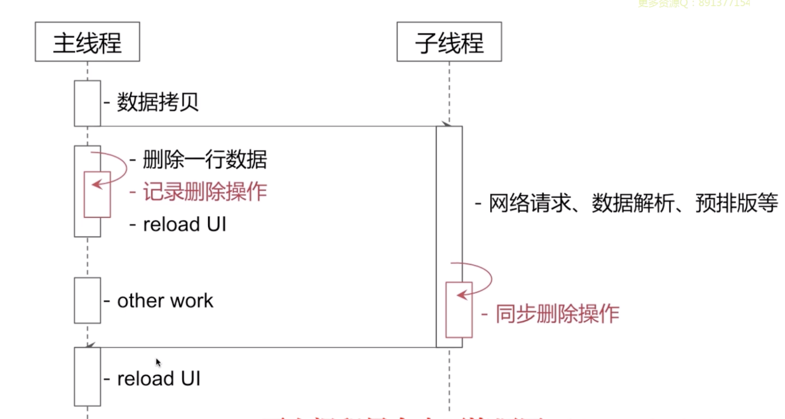
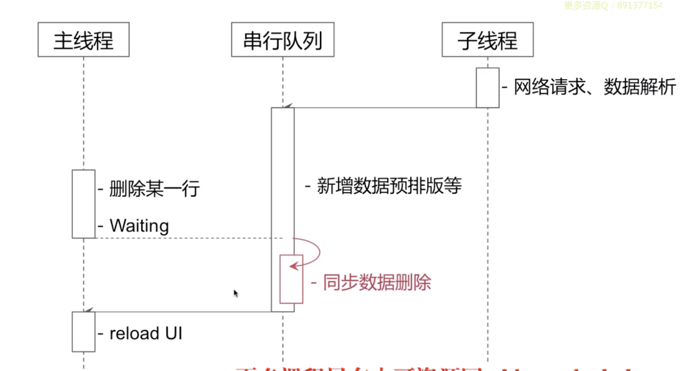

> 一般在新闻，咨询类的app当中

例如，如果要先删除一个数据（新闻）再重新loadmore（在子线程完成）

> 如何多线程下访问

### Sol1 并发访问，数据拷贝

主线程拷贝数据，把拷贝结果给子线程使用，同时子线程做新数据的网络请求

### 串行访问

保证对数据的操作都在串行队列上

| 对比 | 串行                                                 | 并发                                     |
| ---- | ---------------------------------------------------- | ---------------------------------------- |
| 好处 |                                                      |                                          |
| 坏处 | 主线程如果某个删除动作耗时间， 则发生延时现象。 | 记录数据同步动作，拷贝，内存开销会有问题 |

