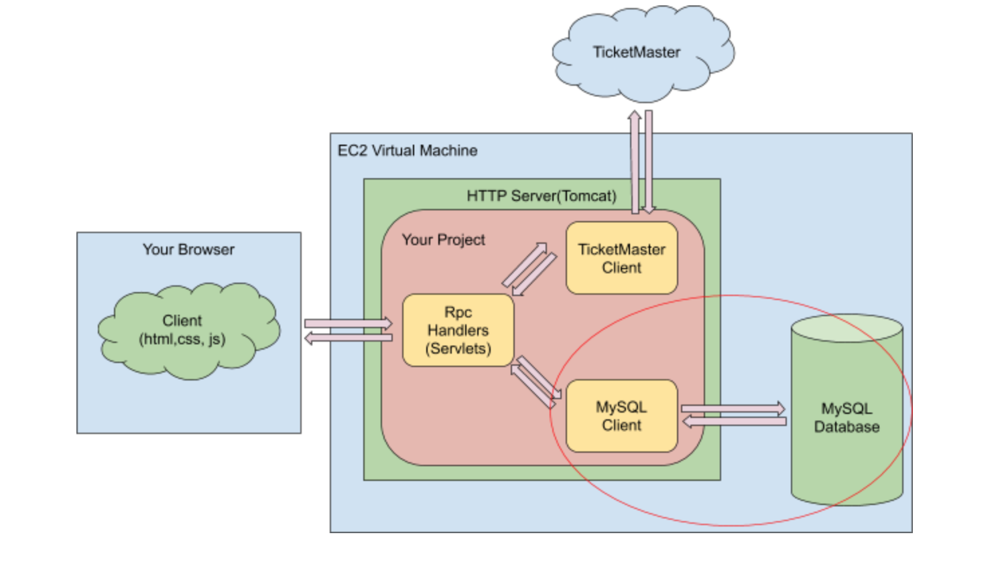

# Delivery

[Front End](##front-end)

* Designed and developed an interactive web page for users to search a nearby delivery dispatcher and allocate a delivery path with **React JS** and [**Redux**](#####React-Redux).

* Implemented features such as “Set up from location”, “Set up destination”, “Selected a delivery route” with **Ant Design, [GeoCoding API](#####Geocoding-API---In-OrderDetails) and [Google Map API](#####map)**.

* Visualized the delivery route, including route distance, total time estimation.

<Code>Utilized</Code>: React & Redux, Ant Design

[Back End](##back-end)

* Designed five [**Java Servlets**](###java-servlet) with **RESTful APIs** to handle http requests, in order to achieve “Search history record”, “Check deliver availability”, “make a delivery order” functionality.

* Generated delivery routes and returned to front-end with **Google Directions API**.

* Build [**MySQL**](###DB-Tables) database on[**Amazon RDS**](###rds) to store users’ order history and ongoing order.

* Deployed to [**AWS EC2**](###ec2) and managed version control with [**Docker**](###docker).

<Code>Utilized</Code>: Java, RESTful API, Full Stack Development, MySQL, [AWS](##AWS)


## Intro

This project's mission is to help people deliver their objects as fast as possible by auto allocate android or drone delivery within San Francisco (884,363 ppl). The entire process is a door-to-door service that is all managed by autonomous driving drones and/or robots. The drone or robot will get to your place, collect your items and talk it to your destination. We believe that through our project, we can significantly reduce the time of entire process and costs from human source on delivering within a city every day

#### Requirements

* Users should be able to register an account and our system should be able to store all history order records.
* After a customer sends a request, our system should be able to allocate a drone/android, based on the customer's location for a customer's service
* Once a delivery service is ordered, we should be able to notify the user (sender or receiver) to pic up the object; Save this record and let users give us a rate therefore we can analyze the service in the future.


## Front End

#### Components Details

* <code>Intro</code> : User Login and Registration

* <code>User-Profile</code>:  User can starts a new order or check his/her history order

* <code>Main1</code>: You can view 3 dispatchers around you through a map window. Set up your starting location and deliver locations, deliver weight.

* <code>Main2</code>: After your selections, there will be 2 (for now) routes generated by **Google Direction API** (from backend) to present. It is an interactive page that user can pick a single one route from the map component, while you make a selection, it's also changing the page on the right side, then move on to next page.

* <code>Main3</code>: Present the final selection of user.

* <code>Final</code>: Order has been sent, order is ready.

  

#### React Components


##### Map

> Used third party api **react-google-maps**.

* Wrapped with GoogleMap.
* Use **Marker** (MapDistriStatMarker, MapUserMarker) to spot markers on map.
* Use **Polyline** (MapRoute) to draw lines.

##### Geocoding API - In OrderDetails

> The Geocoding API is a service that provides geocoding and reverse geocoding of addresses.

```react
//take the place id and return me lat lon
Geocoder = new google.maps.Geocoder();
this.Geocoder.geocoder( {placeId: place_id}, results = {
	const marker = {
		lat:
		lng:
	};

});
```

##### Places - Used in SearchBar with AutoComplete

> Based on a given address (still typing), return a list of guessed location.

```react
service = new google.maps.places.AutocompleteService();
handleSearch = (address) => {
    this.service.getPlacePredictions({ input: address, bounds: BOUNDS}, (value) => {
        this.setState( {
            dataSource : !value ? 
            	[] : value.map(place => ({
                    description: place.description,
                    place_id: place.place_id,
                }))
        });
    });
}
```

##### React-Redux

**index.js** : store all reducers, export them as combined Reducers.

 * [distributionLocationReducer](######distributionLocationReducer)
	* [orderReducer](######orderReducer)
	* [routeInfoReducer](######routeInfoReducer)

###### distributionLocationReducer

* state: 

  * locations: []; stores a list of lat&lng object

* action: 

  * set(locations[]) : reset the entire list

* Use Case: Used in **Main1**, once /availability is done, store all 3 dispatchers location locally.

  * ```react
    //store data - in availability promise
    this.setState({
        distributionStation: data ? data: []
    });
    
    //Set up
    export default connect(
        //state
        ({distributionLocationReducer, orderReducer}) => ({
            locations: distributionLocationReducer.locations,
            markers: orderReducer.markers, // read markers from order reducer???
        }),
        
        //action
        (dispatch) => ({
            set(items){
              dispatch({'type' : 'set', 'newDistributionLocation' : items})  
            },
        })
    )(Main1);
    
    
    //reducers
    const distributionLocationReducer = (state = [], action) => {
        if (action.type === 'set') {
            return {
                locations: action.newDistributionLocation,
            }
        }
        return state;
    }
    export default distributionLocationReducer;
    
    ```

    

###### orderReducer

* states
  * startingLoc : String
  * destination: String
  * weight: float
  * deliverType: String
  * orderID: String
  * price: float
  * distance: float
  * usageTime: float
  * markers: []
* Action
  * setStartLoc
  * setDestination
  * setWeight
  * setBoth: for startingLoc, destination, weight
  * setDistance
  * setPrice
  * setUsageTime
  * setMarkers
  * setDeliverType
  * setOrderID

* Use case 
  * OrderRoute (Main2)
    * Retrieve startingLoc, destination, weight
    * Saved distance, price, usageTime, deliverType, order_id,  
  * OrderDetials (Main1)
    * Retrieve startinglocation, destination, weight
    * Set starting location, destination, markers(for dispatcher), weight

###### routeInfoReducer

* state
  * route_id : String
  * route : [], a list of lat lng object
* action
  * select: reset route_id, to tell me which one user has selected
  * setRoute
  * setRouteInfo: for both route_id and route
* Use Case
  * MapRoute(Map) : once user selected a route, store the route info globally
    * retrieve route_id
    * set route_id and route spots details

## Back End

### Ayalysis

#### Traffic Analysis

* User in the city 884,363 (1 M )
* Estimated no more than 1M Daily Active User(DAU)
* For Registration and Login (MySQL) :
  * Total number of request per person per day: 0.1 
  * Average: 1 QPS
  * Peak: 3 QPS
* Order Delivery Request (NoSQL):
  * total number of request per person per day: 50
  * Order: 0.5 QPS
  * Peak:  1.5 QPS (total 3 QPS for read and write)
* **Summary**: MySQL AWS Aurora is scalable; multi-master; if it's 15k, Aurora won't be useful

#### Storage Estimation

* Request for an order QPD: 50M
* in half year: 50M * 30 Days * 6 months = 9000M = 9 Billion
* in one year: 18 Billion

* Assume each stored object is approximately 500 bytes

* in half year: 9 billion * 500 bytes = 4.5 TB

* in one year: 5TB


Method 1: 热储存 in memory

* Expensive
* redis (disk - consistency) vs memcache (cache) high frequency

Method 2: 冷储存 

* AWS s3 1tb
* cheap
* latency is high (user profile is not allowed this)
* read only


### Java Servlet

[Allocate](##user's-request) :  "/allocate" ; Once the user choose two location on **Main2**, this call will be sent.

[Availability](##check-availability) : "/availability"; **Main1** will call this as long as the component is ready.

[History](####Check-User's-History-Record): "/history";  TBD, used to check user's history order

[Login](####login): "/login"; TBD

[Payment](####payment): "/payment"; Once user click the confirm button on **Main3**, this call will be sent

[Register](####register): "/register"; TBD

### DB-Tables

* [User Table](#####DB---User-Table) :  Store user personal information
* [Dispatchers A, B, C](#####DB---Deliver-Table-for-Dispatcher-A) : current availabel deliver info
* [History Table](#####DB---Delivery-History-Table-(Finished-Order)) :  Store user's history record
* [Order Table](#####DB---Delivery-Order-Table-(On-going-Order)) :  Store a single one user's on going purcharse record
* [Route Info Table](#####DB---Route-Table) :  Store a series temporary available route for a deliver

### API

#### Login

```json
POST /login
{
    "username" : "",
    "password" : ""
}

response : {
    "user_id" : "1111",
    "token" : "xadfaewfwgsdf"
}
```

#### Register

```json
POST /register
body: {
    "useremail" : "",
    "password" : "",
    "username" : ""
}

response: {
    "user_id" : "1111",
    "token" : "dsfasdfwegssfw"
}
```

##### DB - User Table

| userid   | uuid - varchar | Primary Key |
| -------- | -------------- | ----------- |
| username | varchar        |             |
| email    | varchar        |             |
| password | varchar        |             |

* When user registers an account, user should give an user email and password to the backend, backend will save a new user record and generate **UUID** as Primary Key to the database, return the front-end as a response with userid as a Token
* When user logins an account, user sends useremail and password to backend, backend will check if there is an account that useremail == useremail && password ==  password. If yes, return 200 with user id (as Token); if it's not, then just report as user login failed 4xx.

#### Extra

Even though this feature is not implemented but I still should say something more about it.

##### Authentication vs Authorization

Authentication:  Am I?

Authorization: am I authrozied to do?

##### Why do we need Authentication?

1. Access control: user can only access data that are authorized to that user.
2. Logging: record user specific activity for book keeping, statistics, etc.

##### A process of Re-login

```sequence
Client->Home_Page: GET http://locaohost:8080/index.html
Home_Page-->Client: No valid session, redirect to /login.html
Client->Login_Page: GET http://localhost:8080/login.html
Login_Page-->Client: Return login.html
Client->Login_Handler: POST http://localhost:8080/login {user_id=1111, password=2222}
Login_Handler-->Client: Login successfully, redirect to index.html{session_id = abcd}
Client->Home_Page: GET http://localhost:8080/index.html {session_id=abcd}
Home_Page-->Client: Return index.html
Client->Search_Handler: GET http://locohost:8080/search?lat=37&lon=-122 {session_id = abcd}
Search_Handler-->Client: Return search result [{item1: 1111}, {item2: 2222}, {item3: 3333}, ....]
Client->Logout_Handler: GET http://localhost:8080/logout {session_id = abcd}
Logout_Handler-->Client: Session destroyed, redirect to index.html
```


#### Check User's History Record

> Search history order for user_id (This is just for the test)

```json
GET /history?user_id=1111
response: {
    {
    	"drone_id" : "DR001",
    	"user_id" : "1111",
    	"time_start" : "2005-10-30 T 10:45 UTC",
    	"price" : 12,
    	"location_from" : "M4W1W3",
    	"time_end": "2005-10-30 T 10:45 UTC",
    	"order_id": "OR00001",
    	"location_to": "M4W1W3",
    	"total_weight" : 13.5
	}, {
      ...  
    }
}
```

##### DB - Delivery History Table (Finished Order)

| order_id      | varchar   | Primary Key                 | Unique Id                           |
| ------------- | --------- | --------------------------- | ----------------------------------- |
| user_id       |           | Foreign Key from User Table | Should be existed in User table     |
| from_location | varchar   |                             |                                     |
| to_location   | varchar   |                             |                                     |
| deliver_id    |           | Foreign Key from Deliver DB | Which Robot/Drone took the order    |
| time_start    | timestamp |                             | when the order start                |
| time_end      | timestamp |                             | when the user received the order    |
| total_weight  | float     |                             |                                     |
| price         | float     |                             |                                     |
| route         | string    | StringfyJson                | Specific route - a list of lat, lng |

* This is table for recording an order has been finished. So you can check the **time_end** and user-selected **route**.
* Order_id is not firsted generated in this api call -> order_id is first generated [here](####user's-Request)

#### [NOT USING CURRENTLY] When User Make New Order

> Insert a new history record into History Database

```json
POST /history
body: {
    "user_id" : "1111",
    "location_from" : "M3EW4R",
    "location_to" : "T7U7E8",
    "time_start": "test time",
    "time_end" : "test time",
    "total_weight" : 34.7,
    "price" : 90.0
}
```


#### Check Availability

> Check the locations of 3 delivery dispatchers and get the real-time data about amount of delivery drone or robot

```json
GET /availability

response:
[
    {
    "station_id" : "A",
    "station_name" : "Sunset Recreation Center",
    "lat" : 37.7571,
    "lon": -122.4866,
    "drone" : 3,
    "robot" : 15,
	},{
     "station_id" : "B",
     "station_name" : "St Mary's Square",
     "lat" : 37.7920,
     "lon" : -122.4052,
     "drone" : 4,
     "robot" : 2
    },{
     "station_id" : "C",
     "station_name" : "Holly Park",
     "lat" : 37.4414,
     "lng" : -122.2515,
     "drone" : 5,
     "robot" : 6
    }
]
```

##### DB - Deliver Table for Dispatcher A

| deliver_id | varchar | Primary Key |                         |
| ---------- | ------- | ----------- | ----------------------- |
| type       | varchar |             | {"DRONE", "ANDROID"}    |
| states     | varchar |             | {delivering, available} |

* There is also table B, C
* This is used to check availability - count how many available Drone or Android


#### User's Request

> Make a request order

```json
POST /allocate
body: 
{
	"user_id" : "1111",
	"location_from" :  {
		"lat" : 34.2342,
		"lng" : -122.33 
	},
	"location_to" : {
		"lat" : 35.2342,
		"lng" : -123.35
	},
	"total_weight" : 37.0
}

response:
{
    "order_id" : "xxxx",
    "markers" : [{
        "marker_name" : "Starting",
        "location" : {
            "lat" : 37.777642,
            "lng" : -132.233
        }
    }, {
        "marker_name" : "Destination",
        "location" : {
            "lat" : 37.777340,
            "lng" : -122.410350
        }
    }],
    
    "routes" : [
        {
            "route_id" : "RT_SASjsdf23j",
            "price" : 98.6,
            "route" : [
                {
                    "lat" : 37.7521,
                    "lng" : -122.4866
                }, {
                    "lat" : 37.777630,
                    "lng" : -122.496440
                }, {
                    "lat" : 37.777340,
                    "lng" : -122.410350
                }, {
                    "lat" : 37.792,
                    "lng" : -122.4052
                }
            ],
            
            "delivery_type" : "Drone",
            "available_time" : "2019-04-24 18:00:00",
            "usage_time" : "00:15:00",
            "distance" : "534.1"
        }, {
            "route_id" : "RT_lsjdf242ew",
            "price" : 54.2,
            "route" : [
                {
                    "lat" : 37.7521,
                    "lng" : -122.4866
                }, {
                    "lat" : 37.777630,
                    "lng" : -122.496440
                }
            ],
            
            "delivery_type" : "Robot",
            //"available_time" : "2019-04-24 18:00:00",
            "usage_time" : "01:01:12",
            "distance" : "1534.1"
        }
    ]
}


```

##### DB - Delivery Order Table (On-going Order)

| order_id      | varchar   | Primary Key                 | First Created Here         |
| ------------- | --------- | --------------------------- | -------------------------- |
| user_id       |           | Foreign Key From User Table |                            |
| from_location | varchar   |                             |                            |
| to_location   | varchar   |                             |                            |
| deliver_id    |           | Foreign Key from Deliver DB | Empty until user confirmed |
| time_start    | timestamp |                             | Empty until user confirmed |
| total_weight  | float     |                             |                            |
| price         | float     |                             | Empty until user confirmed |
| route         | string    | Encoded Polylines           | Empty until user confirmed |

##### DB - Route Table

| route_id | varchar        | Primary Key |                   |
| -------- | -------------- | ----------- | ----------------- |
| order_id |                | Foreign Key |                   |
| route    | Set of Strings |             | Encoded Lat Lng   |
| type     | varchar        |             | "DRONE" / "ROBOT" |
| price    | float          |             |                   |


* Backend will receive from_location and to_location and use **Google Direction API** to generate a route (decoded string) illustrates a route between these two locations.
* A temporary order record is created here. But **deliver_id**, **time_start**, **price**, **route** will be **empty** as it is not determined yet.
* The available routes details will be saved into DB - Route Table first as a reference - to stores an estimated price - (yes, a route record after 15 days will be cleared out as it is not usaful) 
  And at this time ==a deliver hasn't been allocated as we not sure if user has made a strong decision that he would purchase our service.==
* Reply to Client : Unique Order_id for user to refer an order (to make it an confirmed), and available routes details.


#### Payment

> User has confirmed the service

```json
POST /payment
body: 
{
	"user_id" : "xxxx",
	"order_id" : "OR_1234",
	"route_id" : "RT_SASjsdf23j"
}

response: 
{
	"order_id" : "OR_1234"
}
```

* Find route details by **route_id**, includes **route, type, price** from Route Table
* Based on the deliver type and location, allocate a deliver from A,B,C table, grab it by **deliver_id**, mark that deliver status to be *delivering*
* Re-insert **route**, **deliver_id**, **price** and take the current time as **time_start** into On-Going Order Table


#### End

> User received the order, drone should get back

```json
POST /end
body : 
{
	"order_id" : "OR_1234"    
}

response: 
{
    "response" : "succeed"
}
```

* It is the time that an order has been finished. 
* Transfer an record with id "OR_1234" from On-Going Order Table to History Order Table. Take the current timestamp and recorded it as "time_end"
* Make sure free the current deliver such that deliver_id status is *available* now


## Conflicts

* **React layers vs React Redux**
  * React Layers
    * Pros: Easy to implement
    * Cons: Hard to maintain
    * Cons: Hard to send message over 3 parent-child relationships (Main2 vs Map Route )
  * React Redux
    * Cons: Complexier to implement
    * Pros: Easier to maintain
    * Pros: Solve the problem of our issue - communicate between parents and children

* **Map Logic** : Who decide the logic of retrieved the route; Should the React (frontend) determine a certain route between two locations and sent to the backend? ==It was about how to design a communication between front end and backend, which way is more efficient==
  * There is a Google Map API for backend about determine the route info, and data type can be a list of {lat, lon}
  * We should consider Light UI vs Heavy Backend, backend should handle the logic

* **When to Allocate a Drone?** When user first time to make a wish or user has confirmed the order.

| Solution                                                     | Pros                                                         | Cons                                                         |
| ------------------------------------------------------------ | ------------------------------------------------------------ | ------------------------------------------------------------ |
| Solution A: allocate drone before payment (drone id is holded on Main 2) | After user make a payment, the order will be ready for sure - guaranteed a service is available | 1. If request is busy, could be none drone for user - easily be attacked if multiple users book a service but not paid<br />2. What if the page on Main 2 is closed, we should do extra step to let the backend know that the drone can be released. But how to determine when exactly that user clicked the close button. |
| Solution B: allocate drone after payment                     | Solves the concerns of solution A                            | Latency for user to wait for a deliver to response*          |

*Drone is not available, delay, time might be longer than robot and still more expensive than robot. 
(Sol: merging request from other clients)

## AWS

* [EC2](###EC2)
* [Docker](###docker) : this is not an AWS service, but it's a partner with EC2
* [RDS](###rds)


Feature of Cloud

Pros: 

		* Scalability: 1~2 server
		* Flexibility : EC2; VM; 根据数据类型储存不同的打他
		* On-demand： 按需求charge

Cons: 

* Data safety and privacy ：  自己的东西在别人的server上
* Cannot control downtime： 修server是别人的工作，自己很被动

#### EC2 

Amazon EC2 Elastic Compute Cloud (EC2) allows scalable deployment of applications by providing a Web service through which a user can boot an **Amazon Machine Image** to create a virtual machine, which Amazon calls an "instance", containing any software desired. ==A user can create, launch and determine server instances as needed, paying for the hour for active servers, hence the term "elastic"==.

EC2 is an **Infrastructure as a service (iaas)** : customer provide application , data, OS; Provider will determine the Virtualization, Servers, Storage, Networking.

Steps: 

1. Choose a service EC2, launch an instance
2. select an Amazon Machine Image (choose Ubuntu Server)
3. choose free type of instance type
4. When it's on configuration page, set the port 80, 8080, 22 for 0.0.0.0/0
5. Make sure to generate a key pair
6. Finailly, grab its public IP
7. Connect it on terminal through public ip with the key pair


### Docker

What is Docker?

* A platform for developers/sysadmins/etc to interact  with Linux containers.
* Currently the most popular platform for handling Linux containers.
* 可以更快更敏捷的去部署应用程序。

Why Docker?

* Powerful & Platform Agnostic
* Lightweight : 不再需要vm， 不再需要在vm 装os(前提是登陆上)
* Trending

[reference](https://mp.weixin.qq.com/s/OPxiEQE0FsjJpQtipzFyWQ)

* 隔离强：

  * 该容器包含了应用程序的代码、运行环境、依赖库、配置文件等必需的资源。

    容器之间达到进程级别的隔离，在容器中的操作，不会影响道宿主机和其他容器，这样就不会出现应用之间相互影响的情形！

* 可移植性：自从用上docker容器后，可以实现开发、测试和生产环境的统一化和标准化。
* 轻量和高效： 
  * 和虚拟机相比，容器仅需要封装应用和应用需要的依赖文件，实现轻量的应用运行环境，且拥有比虚拟机更高的硬件资源利用率。
  * 在微服务架构中，有些服务负载压力大，需要以集群部署，可能要部署几十台机器上，对于某些中小型公司来说，使用虚拟机，代价太大。

### RDS

**MySQL** : MySQL is an open-source relational database management system (RDBMS).

**MySQL Workbench** : allows you to test your DB

```sql
use YOUR_DB_NAME;
select * from history where user_id = 1111;
select * from items;
select * from categories;
```


**Amazon RDS**: Amazon Relational Database Service (Amazon RDS) makes it easy to set up, operate, and scale a relational database in the cloud.

Steps

1. Click Security Group
2. Create a Security Group
3. Set up port 3306 for 0.0.0.0/0
4. Choose type MYSQL/Aurora
5. Create MySQL DB Instance on RDS

**JDBC**: JDBC (Java Database Connectivity) provides interfaces and classes for writing database operations. Technically speaking, JDBC is a standard API that defines how Java programs access database management systems.

Since JDBC is a standard specification, one Java program that uses the JDBC API can connect to any database management system(DBMS), as long as a driver exists for that particular DBMS. 

SQL Syntax

* Syntax for [DROP](https://www.w3schools.com/sql/sql_drop_table.asp). 

  * ```sql
    DROP TABLE IF EXISTS table_name;
    ```

* Syntax for [CREATE](http://www.w3schools.com/sql/sql_create_table.asp). 

  * ```sql
    CREATE TABLE table_name (column1 datatype, column2 datatype, ....);
    ```

* Syntax for [INSERT](http://www.w3schools.com/sql/sql_insert.asp).

  * ```sql
    INSERT INTO table_name (column1, column2, column3, ...) VALUES (value1, value2, value3, ...);
    ```



*in Our case, TicketMaster is replaced by Google Direction API*

