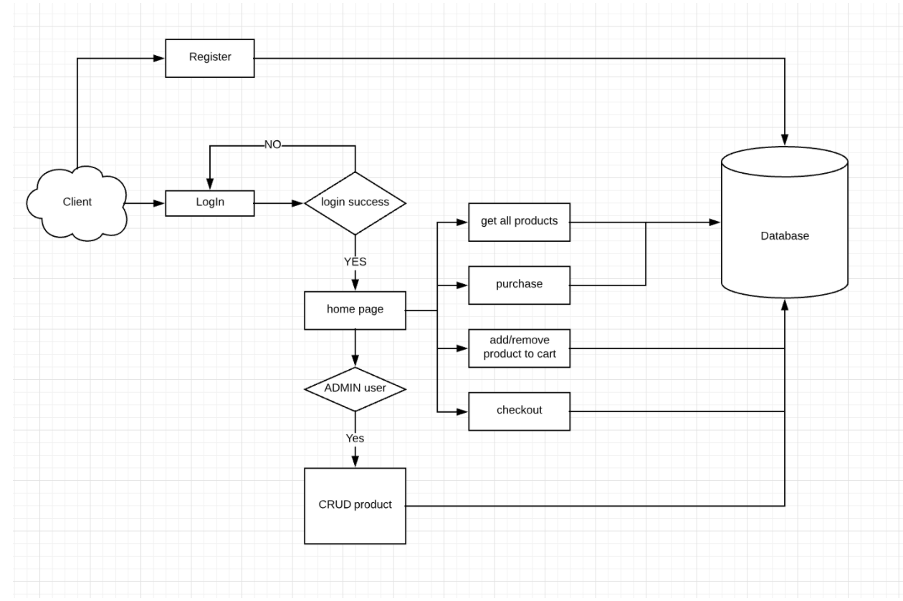
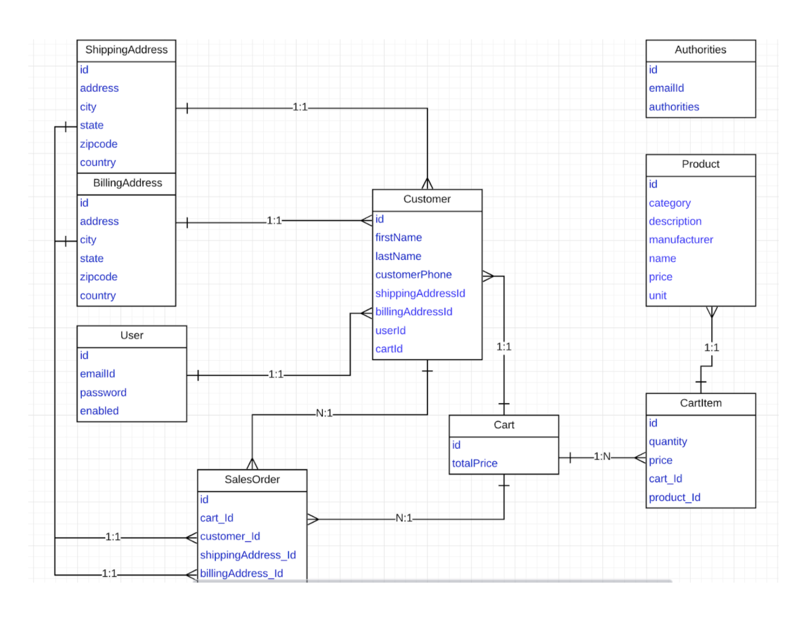

# Online Shopping Chart

## Frontend

## Backend




Entity Relation Diagram




### Spring Framework

#### Why we use Spring?

* **Usability**: Spring through multiple configuration options makes it really easy for developers to start and then configure exactly what they need.
* **Modularity**: We've options to use the entire Spring framework or just the modules necessary. Moreover, we can optionally include one or more Spring projects depending upon the need.
* **End to End Development** **:** Spring supports all aspects of application development, Web aspects, Business aspects, Persistence aspects, etc, so we can develop a complete application using spring.

#### Terminology

* Dependency: 类的成员变量
* 容器：生成bean实例的工厂，并且管理容器中的bean
* injection：容器将所需要的依赖注入到类中的过程
* 控制反转：不在主动创建依赖，而是通过上游中来提供

### Hibernate

For database:

```java
public void saveItem(Item item) {
    ApplicationContext context = new AnnotationConfigApplicationContext(Config.class);
    SessionFactory sessionFactory = (SessionFactory) context.getBean("sessionFactory");

    Session session = sessionFactory.openSession();
    session.save(item);
}

```

* Hibernate is an object-relational mapping tool for the Java programming language which implements the [Java Persistence API](https://docs.google.com/document/d/1imOIt_MCy4QjNLCP2h62ozZTuNPT6LvC7vXkiljFFTc/edit#heading=h.c2s1s4332piw). 
* ==Hibernate's primary feature is mapping from Java classes to database tables, and mapping from Java data types to SQL data types.== Hibernate provides data manipulation facilities.


##### 