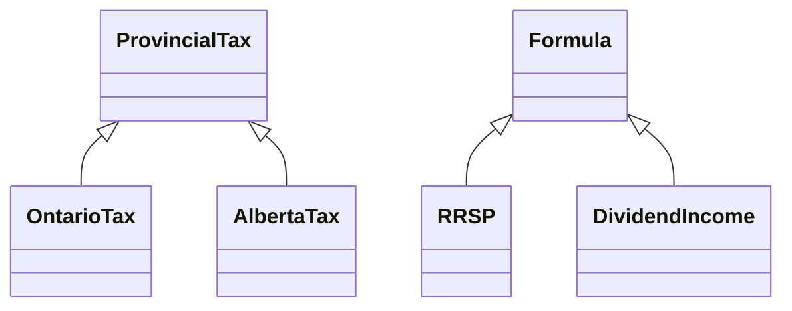
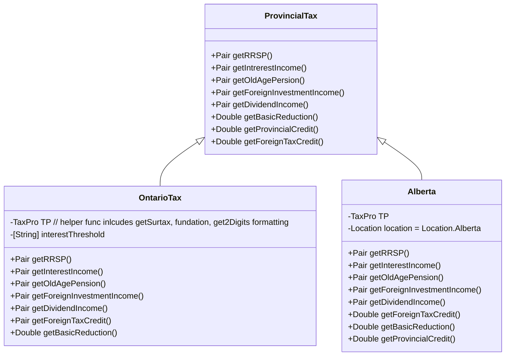
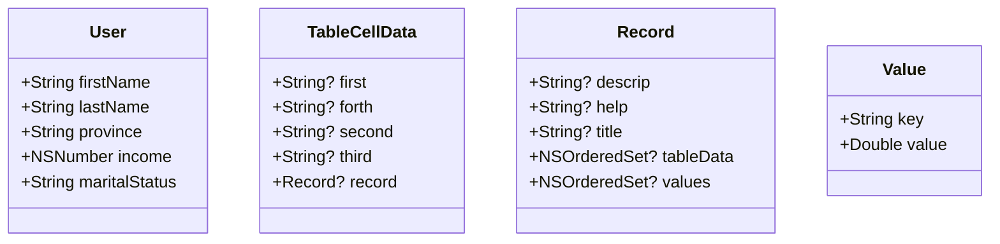
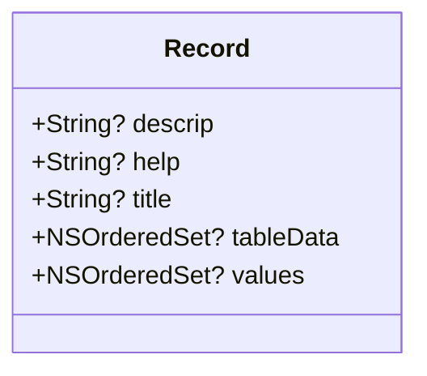

# iOS Tax Calculator App

TaxPro is an iOS mobile app that helps people to estimate their tax return based on user’s total income and location. There are a lot of topics leading to different formulas. User can either type the formula they are looking for or look at a group of formulas. 

* iOS 9.2, worked with Xcode 7.2 in swift 4
* [Design Patterns](##Design-Pattern): Strategy, ~~Factory Method~~, Bridge, Singleton
* [Core Data](##Core-Data): saving and reloading a calculation record and user’s basic information.
* Storyboard + Autolayout + Code: to let the app fits in all size of screen.
* [Charts](##Charts): a third party API to draw a pie chart on output page
* [PureLayout](##PureLayout): a third party API to programmingticaly add autolayout constraint
* [Social + MessageUI](##Social-+-MessageUI) : created sharing functionality and sending email on user’s setting page.
* [Expandable TableView](##Expandable-TableView): for user to pick the sub menu topics. it's changeing the topic layout dynamically
* [Ordered Dictionary + HashSet](##Ordered-Dictionary-+-HashSet) : to set up a priority for the range of income in each topic
* Experienced with Sketch to design User Interface.


## Design Pattern

#### Strategy

**Formula**

Formula description the whole procedure from collecting datas from user's profile (total income, province etc.) to present the tax result based on tax topics. The whold precedure includes: 

>  <Code>**BasicInputsViewController**</Code>
>
> * **initUI(UIViewController)->UIView** : based on the topic, present the topic title and collect data 
>   * *"Interest Income"* form **InterestIncome**; 
>   * *"Contribution"* for **RRSP**.
> * **checkBasicInput()**: make sure user's inputs are valid for above UI
>
> <Code>**ProfileViewController**</Code>
>
> * **setProfile(income, province)**: user's input form for total income and location province
>
> <Code>**ResultViewController**</Code>
>
> * **getInstruction()**: give an intruction for this topic
> * **getResult()**: give actual digit in "$xx.xx" format
> * **retrieveData()** : for saving a record, to retrieve all data in a key-value form
> * **getDefinition()** : explain the topic.
> * **getTip()**: give a tip on how to save more money


Formula includes

>* Tax Credit
> * Deduction
> * RRSP
> * Income
> * Employment
>  * OldAgeSecurityPension
>  * ForeignInvestmentIncome
>  * DividendIncome
>  * InterestIncome


```mermaid
classDiagram
  Formula <|-- RRSP
  Formula <|-- DividendIncome
	Formula : +UIView initUI(_ VC:UIViewController)
  Formula : +setProfile(_ income: Double, province: String)
  Formula : +Data retrieveData()
  Formula : +Double getResult()
  Formula : +String getTip()
  Formula : +String getDefinition()
  Formula : +String getInstruction()
  Formula : +Bool checkBasicInput()

  class RRSP{
  	+Double BasicPersonalAmount() //ON, AB, BC, MB
  	+String getInstruction()
  	+String getDefinition()
  	+Double getBasicReduction() //ON, BC
  	+Double getSingleReduction() //ON, BC
  	+Double getHealthPremium() //ON
  	+Double getProvincialCredit()//BC, MB
  	+Double getSingleProvincialCredit() //BC,MB
  	
  	+UIView initUI()
  	+setProfile()
  	+Double getResult()
  	+Data retrieveData()
  	+String getTip()
  	+String getDefinition()
  	+String displayProcess()
  	+Bool checkBasicInput()
  }
  class DividendIncome {
  	+UIView init()
  	+setProfile()
  	+Double getResult()
  	+Double BasicPersonalAmount()//ON,AB,BC
  	+Double getBasicReduction() //ON,BC
  	+Double getSingleReduction() //ON,BC
  	+Double getHealthPremium()//ON
  	+Double getProvincialCredit()//BC
  	+Double getSingleProvincialCredit()//BC
  	+Double foreignTaxCreditHelper() //ALL
		+Double getForeignTaxCredit() //ALL
		+operationBeforeGettingResult()//ON,BC
		+String getInstruction()
		+Data retrieveData()
		+String getTip()
		+String getDefinition()
		+Bool checkBasicInput()
  }
```

```swift 
class Calculator{
    let strategy : Formula
    
    init (algorithm:  Formula){
        self.strategy = algorithm
    }
    func getResult() -> Double{
        return self.strategy.getResult()
    }
    func getTip() -> String{
        return self.strategy.getTip()
    }
    func getInstruction() -> String{
        return self.strategy.getInstruction()
    }
   /* func displayProcess() -> String{
        return self.strategy.displayProcess()
    }*/
    func initUI(_ VC: UIViewController)->UIView{
        return self.strategy.initUI(VC)
    }
    func setProfile(_ income: Double, province: String){
        self.strategy.setProfile(income, province: province)
    }
    func retrieveData() -> ([String],[Double],[[String]]){
        return self.strategy.retrieveData()
    }
    func getDefinition() -> String {
        return self.strategy.getDefinition()
    }
    func checkBasicInput() -> Bool {
        return self.strategy.checkBasicInput()
    }
    
}
```

in **BasicInputsViewController** or **ProfileViewController**

```swift
var formula = Calculator(algorithm: RRSP.sharedInstance)
```


#### Bridge

It's similar to **Strategy**(dynamically, changed in run-time based on client's behaviour), but there is [difference]( https://www.kancloud.cn/digest/xing-designpattern/143735). Bridge is a concrete implementation and static. 是两个类子对象之间互相拆分和互相重组。*“桥接模式可替换抽象部分中的实现对象， 具体操作就和给成员变量赋新值一样简单。”*

[Read More](https://refactoringguru.cn/design-patterns/bridge)



> When we calculate a result of a topic (RRSP), we actually find an implementation based on it's province (a subclass of ProvincialTax) and we let all the logic written in the subclass of ProvincialTax. It's the communication between those subclasses.

**ProvincialTax**: is an interface of all basic steps for each province to calculate all formulas. For example, the object of **ProvincialTax** includes implementation of A,B,C. RRSP use A+B, and dividend income use B+C and so on. Each province has different parameters and procedures to implement A, B or C, so it's better to create subclass for each province individually. And when meet a particular Formula, just use the instance of ProvincialTax to do the actual behaviour of calculation.

```swift
    func getResult() -> Double {
        var income = profileIncome
        var contribution = Double(self.contribution.text!)
        var vary = income! - contribution!
        var result :Double = 0.0
     
      	//-- HERE IS THE USE OF BRIDGE --
        result = (CurrentProvince.getData(Location(rawValue: profileProvince)!)?.getRRSP(income!, contribution!).result)!
      //CurrentProvince is a static enumurator. pass in Location.Alberta will return us an 
			//alberta formula.
      
      //CurrentProvince.getData(Location("Alberta")) -> AlbertaTax()
      //result = AlbertaTax().getRRSP().result;
        return result     
        
    }
```

Each func in ProvincialTax will take netIncome or other factor as inputs 
return: final result and it's process in **Pair** ["text for description:", "$xx.xx"] format
The province includes 

* Ontario
* Alberta
* British_Columbia
* Manitoba
* Saskatchewan
* Yukon
* New_Brunswick
* Nova_Scotia
* Northwest_Territories

``` swift
protocol ProvincialTax { //in ProvincialTaxPro
    func getRRSP(_ netIncome: Double, _ contribution: Double ) -> (result:Double, process: [[String]])
    func getInterestIncome(_ netIncome: Double, _ interestIncome : Double) -> (result:Double , process: [[String]])
    func getOldAgePension(_ netIncome: Double, _ OASPension: Double, _ OASClawback: Double) -> (result: Double, process: [[String]])
    func getForeignInvestmentIncome(_ netIncome: Double, foreignIncome: Double, foreignTaxPaid: Double, isUSStock: Bool) -> (result:Double, process: [[String]])
    func getDividendIncome(_ netIncome: Double, dividendIncome: Double, ForeignTaxPaid: Double, CanadianCorporation : Bool, StockMarket : Bool, isUSStock : Bool, dividF: Double, dividP: Double) -> (result: Double, process: [[String]])
    
    func getBasicReduction(_ A: Double , _ B: Double, _ special: Bool , _ di: Double  ) -> Double
   // func getHealthPremium(A: Double, _ B: Double) -> Double
    func getProvincialCredit(_ A : Double, _ B: Double) -> Double
    func getForeignTaxCredit(_ income: Double, _ foreignIncome: Double, _ Deduction_2012 : Double, _ Deduction_2011 : Double, _ FederalForeignTaxCredit: Double, _ ProvincialForeignTaxCredit: Double, _ mode: Location,  _ extraDividend : Double ) -> Double
    //func getDividendTaxCredit(netIncome : Double, dividendIncome : Double, mode: Location, CanadianCorporation : Bool, StockMarket : Bool) -> Double
}


enum CurrentProvince {
    static func getData(_ province: Location) -> ProvincialTax? {
      switch province {
        case .Ontario :
                return OntarioTax()
        case .Alberta :
                return AlbertaTax()
        case .British_Columbia :
                return BritishColumbiaTax()
        case .Manitoba :
                return ManitobaTax()
        case .Saskatchewan :
                return SaskatchewanTax()
        case .Yukon :
                return YukonTax()
        case .New_Brunswick :
                return NewBrunswickTax()
        case .Nova_Scotia :
                return NovaScotiaTax()
        case .Northwest_Territories :
                return NorthwestTerritoriesTax()
        default:
                return nil
        }
    }
}
```




#### Singleton

Each formular is a singleton. 

in Tax Credit.swift

```swift
//Adoption_Tax_Credit
static let sharedInstance = Adoption_Tax_Credit()
//Pension_Tax_Credit
static let sharedInstance = Pension_Tax_Credit()
```


## Core Data

#### Before all interactions

```swift
import CoreData
//Find the container inside the AppDelegate
let appDel: AppDelegate = UIApplication.sharedApplication().delegate as! AppDelegate
//Create a context from this container
let context: NSManagedObjectContext =  appDel.managedObjectContext
```

#### Create an entity and new User record

```swift
let entity = NSEntityDescription.entity(forEntityName: "Users", in: context)
let newUser = NSManagedObject(entity: entity!, insertInto: context)
```

#### Save properties

```swift
newUser.setValue("Shashikant", forKey: "username")
newUser.setValue("1234", forKey: "password")
newUser.setValue("1", forKey: "age")
```

#### Obtain the entity to insert a new record - Used in CoreDataSaver

```swift
var newObject = NSEntityDescription.insertNewObjectForEntityForName("entityName", inManagedObjectContext: context)
```

#### To add data to new object

```swift
newObject.setValue(value, forKey: "attributeName")
```

#### To save the context

```swift
do{
	try context.save()
} catch {
	print("ERROR: saving context to Moment")
}
```

#### Fetch request

```swift
let request = NSFetchRequest(entityName: "entityName")
request.predicate = NSPredicate(formate: "predicateString", argForPredicate)
request.returnsObjectsAsFaults = false
//NOTE: if you just want to outline of the request, do request.returnsObjectsAsFaults = true

do {
let results = try context.executeFetchRequest(request)
    if result.count > 0 {
        for result in results as! [NSManagedObject] {
            if let username = result.valueForKey("username") as? String{
                print(username)
            }
        }
    }
} catch {
    print("ERROR: fetching failed")
}
```

#### Operations On Result

**DELETE** : context.deleteObject(result)
**GET VALUE** : result.valueForKey("attributeName")
**SET VALUE** : result.setValue(value, forKey: "attributeName")
**CAST VALUE TO KNOWN DATATYPE** :
if let value = result.valueForKey("attributeName") as? Datatype {
    code
}

#### Predicate String

```swift
let request = NSFetchRequest(entityName: "Users")
request.predicate = NSPredicate(format: "username = %@", "Tommy")
```

#### Relationship

Suppose : many to many relationship with person entity and address entity

Create a relationship:
1. create the set
newPerson.setValue(NSSet(obejct: newAddress), forKey: "addresses")

2. save the newPerson context
    do {
   try newPerson.managedObjectContext?.save()
    } catch {
   errorHandling
    }

  

> NOTE: the Core Data creates the inverse relationship for us
> NOTE: the above save newPerson, newAddress and the relationship

Update a relationship:
1. create an address as above
2. set the value of the new address as above
3. add to the relationship
let addresses = newPerson.mutableSetValueForKey("addresses")
addresses.addObject(otherAddress)

Delete a relationship:
newPerson.setValue(nil, forKey: "addresses")

NOTE: for one to one, you can simply do newPerson.setValue(item, forKey: "oneToOneRelationship")

-------------
reference: https://medium.com/xcblog/core-data-with-swift-4-for-beginners-1fc067cca707

### In App



> Find all relationship in TaxCalculator.xcdatamodeld

### User

**User** is an entity, a type of NSManagedObject.

it's core data properties

```swift
import Foundation
import CoreData

extension User{
    @NSManaged internal var firstname: String
    @NSManaged internal var lastname: String
    @NSManaged internal var province: String
    @NSManaged internal var income: NSNumber
    @NSManaged internal var maritalstatus: String

}
```

it has a default constructor

```swift
    override init(entity: NSEntityDescription, insertInto context: NSManagedObjectContext?) {
        super.init(entity: entity, insertInto: context)
}
```

it also has a self defined constructor

```swift
    init?(firstname: String, lastname: String, province: String, income: Double, marital: String){
        let appDel: AppDelegate = UIApplication.shared.delegate as! AppDelegate
        let context: NSManagedObjectContext =  appDel.managedObjectContext
        let entity = NSEntityDescription.entity(forEntityName: "User", in: context)
        if let entity = entity {
            super.init(entity: entity, insertInto: context)
            setFirstname(firstname)
            setLastname(lastname)
            setProvince(province)
            setIncome(income)
            setMaritalStatus(marital)
            print("Saving a user is done")
            
        }else {
            super.init()
            print("Error:entity not found for User")
            return nil
        }
    }
```

The setter is for it's file properties

```swift
   fileprivate func setProvince(_ province: String){
        self.province = province
    }
   fileprivate func setFirstname(_ first: String){
        self.firstname = first
    }
   fileprivate func setLastname(_ last: String){
        self.lastname = last
    }
   fileprivate func setMaritalStatus(_ m: String){
        self.maritalstatus = m
    }
   fileprivate func setIncome(_ income :  Double){
    self.income = NSNumber(value: income as Double)
    }
```

There is also a list of getter

```swift
    func getIncome() -> Double {
        return Double(self.income)
    }
    func getFirstname() -> String{
        return self.firstname
    }
    func getLastname() -> String {
        return self.lastname
    }
    func getProvince() -> String{
        return self.province
    }
    func getMaritalStatus() -> String{
        return self.maritalstatus
    }
```

Save and delete

```swift
    func save(){
        if let context = self.managedObjectContext {
            do {
                try context.save()
            } catch {
                print("ERROR: fail to save a user")
            }
        }
    }

    func delete() -> Bool {
        if let context = self.managedObjectContext {
            context.delete(self)
            do {
                try context.save()
                return true
            } catch {
                print("ERROR: fail to delete a user")
            }
        }
        return false
    }
```

CoreDataSaver - Save a user

```swift
  static func save_a_user_withUser(_ user: User){
        let appDel: AppDelegate = UIApplication.shared.delegate as! AppDelegate
        let context : NSManagedObjectContext = appDel.managedObjectContext
        let newUser = NSEntityDescription.insertNewObject(forEntityName: "User", into: context)
        newUser.setValue(user.firstname, forKey:"firstname")
        newUser.setValue(user.lastname, forKey:"lastname" )
        newUser.setValue(user.province, forKey: "province")
        newUser.setValue(user.maritalstatus, forKey: "maritalstatus")
        newUser.setValue(user.income,forKey: "income")
        do{
            try context.save()
        } catch {
            print("Saving a user occurs an error, with user func")
        }
        
    }
```

CoreDataFetcher - Fetch a user

```swift
   static func fetch_a_user() -> [User]{
        //let defaultFetchSize = 1
        let appDel: AppDelegate = UIApplication.shared.delegate as! AppDelegate
        let context : NSManagedObjectContext = appDel.managedObjectContext
        let request = NSFetchRequest<NSFetchRequestResult>(entityName: "User")
        //request.predicate = NSPredicate()
        request.returnsObjectsAsFaults = false
       // request.fetchLimit = defaultFetchSize
        do{
            let results =  try context.fetch(request) as! [User]
            //print(results[0].getLastname())
            return results
        } catch {
            fatalError("Fetch Failed")
        }
    }
```


### Record




* title: the name of the formula topic
* descrip : the instruction of the topic
* help : it is the tip from the formula.
* **tableData**: it's a table view inside the record page - this refers another entity
* **values**: the two basic factors for the <Code>pie chart</Code>. (Your input vs your output)

When save a record, we create tableCellData and Values pair to save it together with Record.

```swift
//ResultViewController.swift   

func save(){
        //navigationItem.rightBarButtonItem?.title = "saved"
        navigationItem.rightBarButtonItem = UIBarButtonItem(title: "Saved", style: UIBarButtonItemStyle.plain, target: self, action: #selector(ResultViewController.save))
        navigationItem.rightBarButtonItem?.isEnabled = false
        var xValues : [String]
        var yValues : [Double]
        var tableData : [[String]]
        (xValues,yValues,tableData) = formula.retrieveData()
        
      //Record Object
        var r : Record = Record(title: "A Title..." , descrip: formula.getDefinition(), helpInstruction: formula.getTip())!
      
      //Values for the pie chart
        var v  = [Value]()
        for index in 0..<xValues.count {
            let iv : Value = Value(key: xValues[index], value: yValues[index])!
            v.append(iv)
        }
      
      //Table cell data
        var td = [TableCellData]()
        
        for index in 0..<tableData.count {
            let itd : TableCellData = TableCellData(first: tableData[index][0], second: tableData[index][1], third: tableData[index][2], forth: tableData[index][3])!
           td.append(itd)
            
        }
      
      //Attach Values and TableCellData to the Record
        r.attachTableDataSet(td)
        r.attachValueSet(v)
      
      //Save the Record
        r.save()
        
    }
```


### TableCellData

```swift
[["Net Income", "", "", "1234"], 
 ["Province/Territory", "", "", "Ontario"], 
 ["Interest", "", "", "234"], 
 ["Federal Tax", "", "", "35"], 
 ["Basic Personal Amount", "Federal", "", "-35"], 
 ["Province/Territorial Tax", "", "", "12"], 
 ["Basic Personal Amount", "Ontario", "", "-12"], 
 ["Basic Reduction", "Ontario", "", "0"], 
 ["Health Premium", "Ontario", "", "0"], 
 ["Surtax", "%", "Threshold", ""], 
 ["", "20%", "73145", "0"], 
 ["", "36%", "86176", "0"], 
 ["Tax Payable", "", "", "0"]]
```


## Charts

#### Charts

github link: [link](https://github.com/danielgindi/Charts)

This is the pie chart that I used for ProcessViewController

**PieChartView**

```swift
let pieChartDataSet = PieChartDataSet(values: dataEntries, label: "")
let pieChartData = PieChartData( dataSet: pieChartDataSet)

pieChartDataSet.sliceSpace = 2.0
pieChartDataSet.colors = ChartColorTemplates.colorful()

pieChartDataSet.colors = colors

pieChart.chartDescription?.text = ""
pieChart.chartDescription?.textAlign = .center
pieChart.chartDescription?.font = UIFont(name: HEADERFONT, size: 18)!
pieChart.chartDescription?.xOffset = 100.0
pieChart.chartDescription?.yOffset = 0.0
//pieChart.setDescriptionTextPosition(x: 100.0, y: 0.0)
// pieChart.highlightPerTapEnabled = false
//This below is used to save a piechart
//pieChart.saveToCameraRoll()
pieChart.data = pieChartData
```


## PureLayout

Was used for the animated **search bar** on **HomeViewController** - (installed with Cocoapods) to create auto layout constraints. PureLayout supports all Auto Layout features including inequalities, priorities, layout margins, identifiers, and much more. It's a comprehensive, developer-friendly way to use Auto Layout.

[Reference link](http://www.benmeline.com/search-bar-animation-with-swift/)

[github link](https://github.com/PureLayout/PureLayout#sample-code-swift)

First set up searchBar: UISearchBar, searchButton: UIButton, resultTable:UITableview on **MainView**, give autolayout constraint for their correct position

```swift
    override func updateConstraints() {
        if !didSetupConstraints {
            searchBar.autoAlignAxisToSuperviewAxis(.Vertical)
            searchBar.autoMatchDimension(.Width, toDimension: .Width, ofView: self)
            searchBar.autoPinEdgeToSuperviewEdge(.Top)

            searchButton.autoSetDimension(.Height, toSize: searchButtonHeight)
            searchButton.autoSetDimension(.Width, toSize: searchButtonWidth)
            searchButton.autoCenterInSuperview()

            resultsTable.autoAlignAxisToSuperviewAxis(.Vertical)
            resultsTable.autoPinEdgeToSuperviewEdge(.Leading)
            resultsTable.autoPinEdgeToSuperviewEdge(.Trailing)
            resultsTable.autoPinEdgeToSuperviewEdge(.Bottom)
            resultsTable.autoPinEdge(.Top, toEdge: .Bottom, ofView: searchBar)

            didSetupConstraints = true
        }

        super.updateConstraints()
    }
```

Attach **MainView** to the ViewController, right now there is only searchButton

```swift
    override func updateViewConstraints() {
        if !didSetupConstraints {
            mainView.autoPinToTopLayoutGuideOfViewController(self, withInset: 0)
            mainView.autoPinToBottomLayoutGuideOfViewController(self, withInset: 0)
            mainView.autoPinEdgeToSuperviewEdge(.Leading)
            mainView.autoPinEdgeToSuperviewEdge(.Trailing)
            didSetupConstraints = true
        }

        super.updateViewConstraints()
    }
```

Added searchClick to the searchButton to show the rest content.

(please see the reference link for the rest :))

The other use of PureLayout was on **EmptyBackgroundView**. which was set up as background view such that if there is no result showing on search bar, we then present this view.

[reference link](http://www.benmeline.com/ios-empty-table-view-with-swift/)

## Social + MessageUI

[Reference](http://www.theappguruz.com/blog/social-messageui-framework-swift)

**Social** is for share info on your Facebook, Twitter or in-message

Here is a code from **SettingsTableViewController**

```swift
    //Reference: sharing.......
    func showAlertMessage(_ message: String!) {
        let alertController = UIAlertController(title: "Accounts", message: message, preferredStyle: UIAlertControllerStyle.alert)
        alertController.addAction(UIAlertAction(title: "OK", style: UIAlertActionStyle.default, handler: nil))
        present(alertController, animated: true, completion: nil)
    }

    func sharing() {
        let actionSheet = UIAlertController(title: "", message: "Share TaxPro to your friends!", preferredStyle: UIAlertControllerStyle.actionSheet)
        // Configure a new action for sharing the note in Twitter.
        let tweetAction = UIAlertAction(title: "Share on Twitter", style: UIAlertActionStyle.default) { (action) -> Void in
            if SLComposeViewController.isAvailable(forServiceType: SLServiceTypeTwitter){
                let twitterComposeVC = SLComposeViewController(forServiceType: SLServiceTypeTwitter)
                twitterComposeVC?.setInitialText(self.sharingTitle)
                twitterComposeVC?.add(self.sharingImage)
                twitterComposeVC?.add(self.sharingURL)
                self.present(twitterComposeVC!, animated: true, completion: nil)
            } else {
                self.showAlertMessage("You are not logged in to your Twitter account")
            }
            
        }
        
        // Configure a new action to share on Facebook.
        let facebookPostAction = UIAlertAction(title: "Share on Facebook", style: UIAlertActionStyle.default) { (action) -> Void in
            if SLComposeViewController.isAvailable(forServiceType: SLServiceTypeFacebook){
                let facebookComposeVC = SLComposeViewController(forServiceType: SLServiceTypeFacebook)
               // facebookComposeVC.setEditing(true, animated: true)
                facebookComposeVC?.setInitialText(self.sharingTitle)
                facebookComposeVC?.add(self.sharingImage)
                facebookComposeVC?.add(self.sharingURL)
                self.present(facebookComposeVC!, animated: true, completion: nil)
            } else {
                self.showAlertMessage("You are not connected to your Facebook account.")
            }
        }
        
        // Configure a new action to show the UIActivityViewController
        let moreAction = UIAlertAction(title: "More", style: UIAlertActionStyle.default) { (action) -> Void in
            //第一个参数是一个数组，里面包含了我们想要发送的内容
            //具体来说，如果我们只有一张图片，那么就不会显示「Add to reading list」!!!
            //Attach link here!
            let activityViewController = UIActivityViewController(activityItems: ["Share this app to your friends"], applicationActivities: nil)
            //activityViewController.excludedActivityTypes = [UIActivityTypeMail]
            self.present(activityViewController, animated: true, completion: nil)
        }
        
        
        let dismissAction = UIAlertAction(title: "Close", style: UIAlertActionStyle.cancel) { (action) -> Void in
            
        }
        
        actionSheet.addAction(tweetAction)
        actionSheet.addAction(facebookPostAction)
        actionSheet.addAction(moreAction)
        actionSheet.addAction(dismissAction)
        
        present(actionSheet, animated: true, completion: nil)
    }
```

**MessageUI** : is for sending message via mail service on the phone. 

Should attach **MFMailComposeViewControllerDelegate** on the view Controller

```swift
 //=======================Sending Message=============================
    func sendEmail(){
        print("Sending an email...")
        print(self.messageBody)
        let mailComposeViewController = configuredMailComposeViewController()
        if MFMailComposeViewController.canSendMail(){
            self.present(mailComposeViewController, animated: true, completion: nil)
        } else {
            self.showSendMailErrorAlert()
        }
    }
    func configuredMailComposeViewController() -> MFMailComposeViewController {
        let mailComposerVC = MFMailComposeViewController()
        mailComposerVC.mailComposeDelegate =  self
        mailComposerVC.setToRecipients(["lalaphoon@gmail.com", "will@wtctax.ca"])
        mailComposerVC.setSubject(self.messageTitle)
        mailComposerVC.setMessageBody(self.messageBody, isHTML: false)
        return mailComposerVC
    }
    func showSendMailErrorAlert(){
        let sendMailErrorAlert = UIAlertController(title: "Could Not Send Email", message: "Your device could not send e-mail. Please check e-mail configuration and try again.", preferredStyle:  UIAlertControllerStyle.alert)
    }
    func sendAlert(_ alertTitle : String, alertMessage : String){
        let alert = UIAlertController(title: alertTitle, message: alertMessage, preferredStyle: .alert)
        alert.addAction(UIAlertAction(title: "OK", style: UIAlertActionStyle.default, handler: nil))
        self.present(alert, animated: true, completion: nil)
    }
    func mailComposeController(_ controller: MFMailComposeViewController, didFinishWith result: MFMailComposeResult, error: Error?) {
        self.dismiss(animated: true, completion: nil)
        switch result.rawValue {
        case MFMailComposeResult.cancelled.rawValue:
            print("Cancelled mail")
            sendAlert("Sending Cancelled", alertMessage: "You have cancelled sending your email!")
        case MFMailComposeResult.sent.rawValue:
            print("Mail Sent")
            sendAlert("Mail Sent", alertMessage: "Your email has been sent to us!\n Thank you very much!")
        case MFMailComposeResult.saved.rawValue:
            print("You saved a draft of this email")
            break;
        default:
            break
        }
        
    }
```

## Expandable TableView

[Reference](https://www.appcoda.com/expandable-table-view/) 

 It's the tableview to allow cell expands and collapse - showing or hiding the information - to display on-demand informations to users.

*"With them, ==it’s not necessary to create new view controllers== just to ask users for data that in any case should exist in one, default view controller. For example, with expandable cells you can show and hide options of a form that collects data without having to leave that view controller at all."*

I used the expandable tableview to present a relationship of topics in **SubMenuViewController.swift**

> * Income - [Topic]
>   * Investment Income - [Subtopic]
>     * **Sale of Publicly traded shares** - [items]
>     * **Sale of Mutual fund units**
>     * **Sale of bounds**
>     * ...
>   * Employment
>     * **Employment Income**
>     * **Allowances**
>     * **Expense reimbursement**
>     * **Stock option**
>     * ...
>   * Interest Income
>     * **Interest income from bank deposits**
>     * **Interest income from money loaned**
>     * **Interest income from bonds**
>     * ...
>   * Divided Income
>     * **Dividend income from securities**
>     * **Dividend income business**
>     * **Dividend income (non-eligible only)**
>     * ...
> * Deduction
>   * ...
> * TaxCredit
>   * ...

Procedure:

* Prepare a set of customized cell - NormalCell.xib, TextfieldCell.xib, DatePickerCell.xib. In our case we only use NormalCell.xib, and make sure my table view recognize those tablecells and be able to reuse them

```swift
tblExpandable.register(UINib(nibName: "NormalCell", bundle: nil), forCellReuseIdentifier: "idCellNormal")
```

* Wrote other tableview delegates

* Get the CellDescriptor done prepared. it's dynamically changed in our case. It will reload a new list as long as user switch to a new topic.

  The format of the cellDescriptor should be like this

  > Root
  >
  > ​	-Item 0 //For section 1
  >
  > ​		-Item 0 //for the actual cell
  >
  > ​			-**isExpandable**: Boolean  to descript if this cell is expandable
  >
  > ​			-**isExpanded**: Boolean : is this cell has been expanded
  >
  > ​			-**isVisible**: Boolean when it's parent is an expandable cell and expanded, turn on the visibility as a child
  >
  > ​			-**value**: String
  >
  > ​			-**primaryTitle**: String
  >
  > ​			-**secondaryTitle**: String
  >
  > ​			-**cellIdentifier**: String to let the tableviewcell know which xib you are using
  >
  > ​			-**additionalRows**: Number : if youare an expandable cell, you will have a value of greater than 0. Otherwise, 0 means you are the lowest child.

  ```swift
  //This is the helper funcs that I used to insert table view cell's info.    
  
  
  func addNormalCell(_ Title: String, _ child: Int, _ guy: NSMutableArray){
        guy.add(["additionalRows":child, "cellIdentifier":"idCellNormal", "isExpandable": true, "isExpanded": false, "isVisible": true, "secondaryTitle":Title, "primaryTitle":"", "value":""])
      }
      
  func addValueCell(_ Title: String, _ guy:  NSMutableArray){
            guy.add(["additionalRows":0, "cellIdentifier":"idCellValuePicker", "isExpandable": false, "isExpanded": false, "isVisible": false, "secondaryTitle":"", "primaryTitle":Title, "value":""])
      }
      
  func addTopicGroupCell(_ what: [String]) -> NSMutableArray{
          let guy = NSMutableArray()
          addNormalCell("Topic", what.count, guy)
          for i in what{
              addValueCell(i, guy)
          }
          return guy
      }
  ```

* Set up logic for cell item clicked 

  * If the expandable Item cell was clicked for expanded the new items, 
    * inserts those items
    * make sure to reset the expanded to be true in cellDescriptors 
    *  call tableView.reloadData(); 

  * if the item cell clicked was not for expanded, it means it needs to pick a value:
    * retrieve the text value on the UILabel 
    * Reset it to it's parent's primary value 
    * let the current cell(with it sibling) to be invisible
    * And make sure let its parent not to be expanded anymore (since a value is picked already)
    * tableView.reloadData(); 

  > For more info about how to dynamically load cell items info, please go check **tableView(didSelectRowAt)** in **SubMenuViewController.swift**

#### Bug Report

Had error for dynamically inserting a new row into the CellDescript.plist

> I'm trying to add programmatically section and rows to the project. So what I do is to create another NSMutableArray and add this array to the cellDescriptors. Basically what I do for that;
>
> var myNewNSMutableArray = NSMutableArray() //create empty array
>
> //adding dictionaries to the NSMutableArray
> myNewNSMutableArray.addObject(["additionalRows": 2, "cellIdentifier": "idCellNormal", "isExpandable": true , "isExpanded": false , "isVisible": true , "secondaryTitle": "", "primaryTitle": "myTitle", "value" : ""])
>
> // Adding the array to cellDescriptors
> cellDescriptors.addObject( myNewNSMutableArray )
>
> It does work great until I select the row to be expanded. The crash occurs at the following line;
> cellDescriptors[indexPath.section][indexOfTappedRow].setValue(shouldExpandAndShowSubRows, forKey: "isExpanded")
>
> Where the error shows that the key "isExpanded" is not found;
> Error: this class is not key value coding-compliant for the key isExpanded
>
> Is there any way to work around this error without having to add manually all the row in the cellDescriptor.plist ?

Here is my fix

> I figured out the solution, you have to switch NSMutableArray to be NSMutableDictionary and so it will do the setValue forKey things:
> code could be like this (where you pointed out for the error):

```swift
var array: NSMutableArray = cellDescriptors[indexPath.section].mutableCopy() as! NSMutableArray
var test : NSMutableDictionary = cellDescriptors[indexPath.section][indexOfTappedRow].mutableCopy() as! NSMutableDictionary
test.setValue(shouldExpandAndShowSubRows, forKey: "isExpanded")
array.replaceObjectAtIndex(indexOfTappedRow, withObject: test)
cellDescriptors[indexPath.section] = array
```

[reference](https://stackoverflow.com/questions/20075977/setvalueforundefinedkey-this-class-is-not-key-value-coding-compliant)

## Ordered Dictionary + HashSet

#### Ordered Dictionary

[Reference 1](https://www.raywenderlich.com/3535703-swift-generics-tutorial-getting-started)

[Reference 2](http://timekl.com/blog/2014/06/02/learning-swift-ordered-dictionaries/)

##### When I use it?

I used it for split the range for bracket percentage - TaxPro.swift. What I wanted to do was to find a certain range of the total income so i can get the correct bracket percentage. By using this you don't have to resort everytime, just compare them with an order by index, compare with the key value and get the actual value for the percentage

```swift
ProvincialBracketDict[Location.Ontario]?.insert(0.1316, forKey: 220000, atIndex: 0)
ProvincialBracketDict[Location.Ontario]?.insert(0.1216, forKey: 150000, atIndex: 1)
ProvincialBracketDict[Location.Ontario]?.insert(0.1116, forKey: 83075, atIndex: 2)
ProvincialBracketDict[Location.Ontario]?.insert(0.0915, forKey: 41536, atIndex: 3)
ProvincialBracketDict[Location.Ontario]?.insert(0.0505, forKey: 0, atIndex: 4)
```

