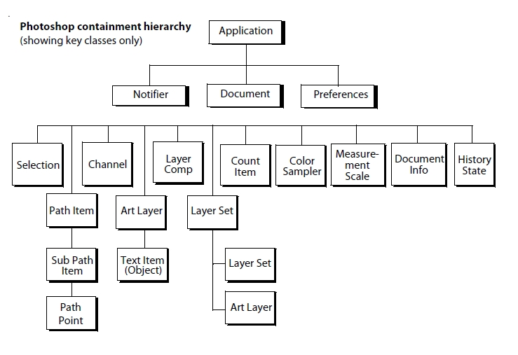
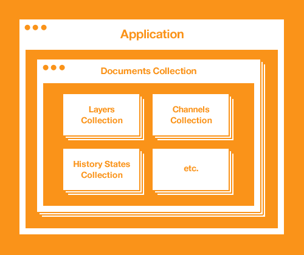

# Uncaged Cards Generator

  [uncaged-cards.com ](https://uncaged-cards.com/)

* Designed and created the entire auto card generator system by using **Photoshop Scripting** to reduce the total working times and human efforts. 
* Be able to produce gaming cards in both **psd** and **jpg** format.
* Generated 200+ cards within 15 mins which is **20 times faster** than the traditional way.
* <Code>Leveraged Knowledge</Code> in JavaScript, OOD, Photoshop, Independent Project

#### Overall

Use several javascript to let photoshop execute an order to generate a few psd files. The process includes create a new doc, put image and text layers overlap to each other, crop the unused black border, translated it to an png or a psd file.

#### Photoshop Scripting - javascript

[Reference](https://www.smashingmagazine.com/2013/07/introduction-to-photoshop-scripting/)

A document object model (**DOM**) is an application programming interface (API), which allows you to programmaticlaly access various components of a **document**

The photoshop DOM consists of a hierarchical representation of the Photoshop application.

The Photoshop object model is a **containment hierarchy**, which means that objects in the model are identified partially by the objects that contain them.

Application (DOM) - Photoshop, Illustrator -  is the root of the Photoshop object model hierarchy; 
	|Documents Collection
			|Document Objects - make modifications to the document **image.** - crop, rotate, flip the canvas

​												  **activeObject**: property of parent object to set the active object front-most

​					|ArtLayers collection - Image contents
​							|TextItem (Object)
​					|HistoryStates collection - keep track changes made to the document
​					|Layers collection
​					|Layersets collection - zero or more art layers, an image is composed by multiple layers
​					|Channels collection - store pixel information about image's color




#### Project Structure

> Image is composed by a set of layers.

```javascript
var docRef = app.documents.add(4,4) //4 inches, 4 inches
app.activeDocument = docRef // set the current active doc is docRef
```


## Main

​	| CreateACard

​		| Helper: labels HEADER and DIR

​				|InsertBGImage

​				|InsertText

​				|Utility

​				|SmallIcon

​				|CreateNewDoc

​				|UncagedInfo


#### Helper - split words with different font component

```javascript
function splitToFonted(sentence) {
    //P: punch
    //L: level change
    //K: kick
    //S: special
    //C: combo-breaker
    //D: Defence
    //G: submission
    var keywords = ["L", "P", "c", "K","S", "D", "G"]
    var result;
    keywords.forEach(function(keyword) {
        if(sentence.indexOf(keyword) >= 0) {
            var words = sentence.split(keyword);
            for(var i = 0; i < words.length; i++) {
                result.add(words[i]);
                result.add(keyword);
            }
        }
    })
}
```


#### Question I Asked For Development

[How to set multi fonts in one textItem?](https://community.adobe.com/t5/photoshop/how-to-set-multi-fonts-in-one-textitem/m-p/4681944?page=1#M280423)

[How can I get different fonts in textItem object?](https://community.adobe.com/t5/photoshop/how-can-i-get-different-fonts-in-textitem-object/m-p/9169968?page=1#M98116)

[Can a script determine number of lines in a paragraph?](https://community.adobe.com/t5/photoshop/can-a-script-determine-number-of-lines-in-a-paragraph/m-p/9413898?page=1#M120522)

[Script with Magic Wand](https://community.adobe.com/t5/photoshop/script-with-magic-wand/m-p/2783771?page=1#M280414)

#### Problem I Met

##### How to merge a text with icon?

Step1. Create a new font for the icons and import it into Photoshop.

Step2. Think about how to merge text with different fonts.

* by looking at the problem "How can I get different fonts in textItem object"
* **Action Manager** code (as recorded by ScriptingListener.plugin) can be used to create type layers with different text properties like font for different letters.

Step 3. In order to set up the text box width, just find the actived textitem after step 2 and set up the width in a general way.

##### Some Cards Were Showing Weird Words + Layout Were Wrong

Due to some of cards written in excel were having multiples lines (Some item requires a single line, while it's finished in 2 lines).  So I wrote a Python script to help me calculate the total lines of each cards in csv format. Generally speaking, a card will have 7 lines, and if a card has 8 lines or 6 lines, I will need to take a look. 

#### Extra Knowledge

[Scripting Listener](https://blogs.adobe.com/crawlspace/2006/05/installing_and_1.html)


